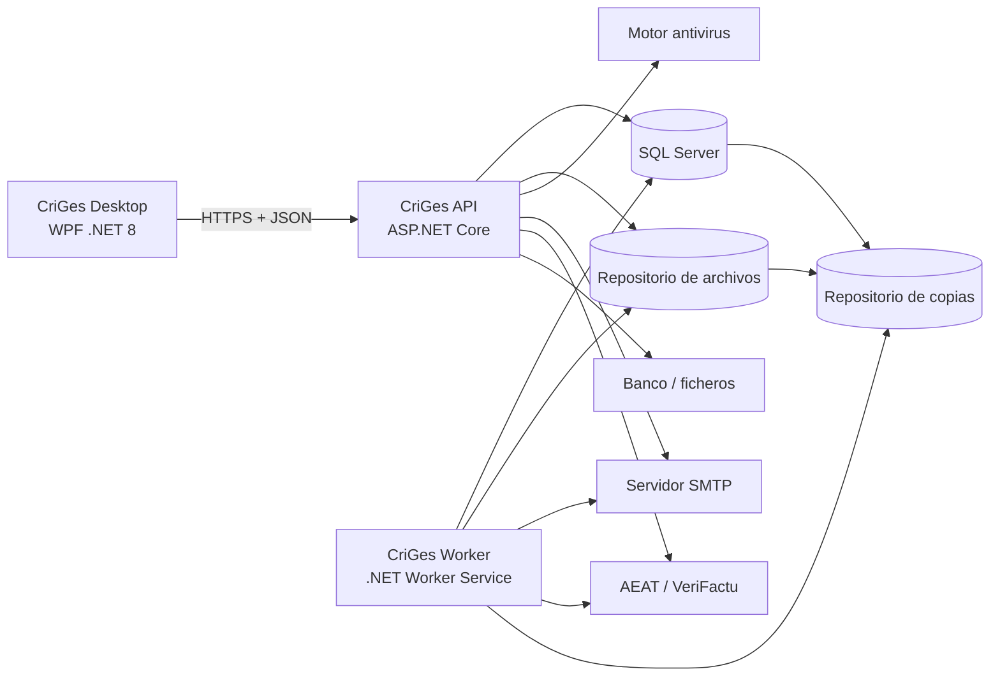
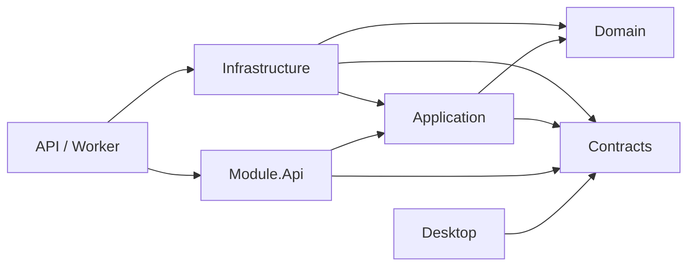

# Arquitectura técnica general

## 1. Propósito

Este documento define la arquitectura técnica inicial de CriGes.

La solución será:

- Una aplicación de escritorio para Windows.
- Conectada exclusivamente a una API central.
- Implementada en .NET 8.
- Organizada como monolito modular.
- Respaldada por una base de datos SQL Server central.
- Preparada para varios puestos concurrentes.

La arquitectura prioriza:

- Seguridad.
- Integridad transaccional.
- Trazabilidad.
- Mantenibilidad.
- Despliegue sencillo.
- Evolución modular.

## 2. Decisiones principales

| Área | Decisión |
|---|---|
| Cliente | WPF sobre .NET 8 |
| Presentación | MVVM |
| API | ASP.NET Core Web API .NET 8 |
| Arquitectura | Monolito modular |
| Procesos de fondo | .NET Worker Service |
| Base de datos | SQL Server |
| Acceso a datos | Entity Framework Core 8 |
| Consultas complejas | EF Core con SQL parametrizado cuando sea necesario |
| Autenticación | Usuario y contraseña contra API |
| Sesión | Access token breve y refresh token opaco |
| Autorización | Políticas y permisos validados en servidor |
| Contraseñas | ASP.NET Core Identity PasswordHasher o equivalente PBKDF2 versionado |
| Tiempo | UTC en servidor; presentación `Europe/Madrid` |
| Archivos | Repositorio protegido fuera de la base de datos |
| Metadatos de archivo | SQL Server |
| Eventos internos | Eventos de dominio y aplicación |
| Entrega fiable | Outbox transaccional |
| Observabilidad | Logs estructurados, métricas y trazas |
| Pruebas | Unitarias, integración, contrato y extremo a extremo |

## 3. Vista general



## 4. Estilo arquitectónico

### Monolito modular

La primera versión se desplegará como una única aplicación servidor con módulos internos bien delimitados.

Ventajas:

- Transacciones ACID entre módulos económicos.
- Menor complejidad operativa que microservicios.
- Un único despliegue central.
- Consultas e informes más simples.
- Posibilidad de separar módulos posteriormente.

### Restricciones

- Cada módulo tiene su propio modelo y servicios.
- Un módulo no modifica directamente las tablas de otro.
- La comunicación se realiza mediante contratos de aplicación o eventos.
- Las dependencias siguen el mapa funcional.
- No se comparten entidades de dominio entre módulos.

## 5. Aplicaciones desplegables

### `CriGes.Desktop`

Aplicación WPF instalada en cada puesto.

Responsabilidades:

- Interfaz.
- Navegación.
- Validaciones de experiencia de usuario.
- Caché de lectura no sensible.
- Gestión local segura del token.
- Descarga y carga de archivos a través de la API.

No puede:

- Conectarse directamente a SQL Server.
- Aplicar reglas de negocio finales.
- Autorizar operaciones.
- Generar numeraciones.
- Almacenar contraseñas.

### `CriGes.Api`

Proceso central ASP.NET Core.

Responsabilidades:

- Autenticación y autorización.
- Casos de uso.
- Reglas de negocio.
- Transacciones.
- Persistencia.
- Auditoría.
- APIs de lectura y escritura.
- Integraciones síncronas necesarias.

### `CriGes.Worker`

Proceso central para tareas de fondo.

Responsabilidades:

- Procesar Outbox.
- Notificaciones diferidas.
- Reintentos SMTP.
- Reintentos VeriFactu.
- Caducidad de sesiones.
- Retenciones y limpieza.
- Avisos periódicos.
- Copias de seguridad.
- Trabajos largos.

El Worker comparte ensamblados de módulos con la API, pero se despliega como proceso separado.

## 6. Estructura de solución

```text
CriGes.sln
├── src/
│   ├── Apps/
│   │   ├── CriGes.Desktop/
│   │   ├── CriGes.Api/
│   │   └── CriGes.Worker/
│   ├── Tools/
│   │   └── CriGes.DbMigrator/
│   ├── BuildingBlocks/
│   │   ├── CriGes.SharedKernel/
│   │   ├── CriGes.Application.Abstractions/
│   │   ├── CriGes.Infrastructure/
│   │   └── CriGes.Contracts/
│   └── Modules/
│       ├── Platform/
│       │   ├── CriGes.Modules.Platform.Domain/
│       │   ├── CriGes.Modules.Platform.Application/
│       │   ├── CriGes.Modules.Platform.Infrastructure/
│       │   ├── CriGes.Modules.Platform.Contracts/
│       │   └── CriGes.Modules.Platform.Api/
│       ├── Customers/
│       ├── Catalog/
│       ├── Subscriptions/
│       ├── Billing/
│       ├── Support/
│       ├── Accounting/
│       └── Treasury/
└── tests/
    ├── Architecture/
    ├── BuildingBlocks/
    ├── Platform/
    └── EndToEnd/
```

Cada módulo seguirá la misma separación interna cuando su tamaño lo justifique.

## 7. Capas por módulo

### Domain

Contiene:

- Agregados.
- Entidades.
- Objetos de valor.
- Eventos de dominio.
- Servicios de dominio.
- Invariantes.

No referencia:

- EF Core.
- ASP.NET Core.
- WPF.
- SQL Server.
- SMTP.
- Sistemas externos.

### Application

Contiene:

- Casos de uso.
- Comandos y consultas.
- DTO internos.
- Validación de entrada.
- Autorización de aplicación.
- Puertos.
- Coordinación transaccional.

### Infrastructure

Contiene:

- EF Core.
- Repositorios.
- SQL.
- Cifrado.
- Archivos.
- SMTP.
- Antivirus.
- VeriFactu.
- SEPA.
- Norma 43.
- Copias.

### Contracts

Contiene contratos estables para:

- API.
- Eventos de integración.
- Comunicación entre módulos.

No expone entidades de dominio.

### Api

Contiene el adaptador HTTP propio del módulo:

- Endpoints.
- Traducción entre contratos HTTP y casos de uso.
- Políticas y metadatos de autorización.
- Registro OpenAPI.
- Canales SignalR del módulo.

No contiene reglas de negocio ni accede a EF Core.

## 8. Dependencias de código



Reglas:

- Domain no depende de ninguna capa.
- Application depende de Domain.
- Infrastructure implementa puertos de Application.
- El adaptador Api depende de Application y Contracts.
- La composición de dependencias se realiza en API y Worker.
- Desktop solo consume contratos HTTP.

## 9. Persistencia

### SQL Server

Se utilizará una base de datos central.

Motivos:

- Transacciones robustas.
- Buen soporte para concurrencia.
- Herramientas de copia y restauración.
- Índices y consultas contables.
- Integración natural con .NET.

### Esquemas

Cada módulo tendrá un esquema lógico:

- `platform`.
- `customers`.
- `catalog`.
- `subscriptions`.
- `billing`.
- `support`.
- `accounting`.
- `treasury`.

Las tablas transversales utilizarán `platform`.

### DbContext

Preferencia:

- Un `DbContext` por módulo.
- Una conexión y base de datos compartidas.
- Un coordinador explícito para transacciones entre contextos.

Para operaciones críticas se podrá:

- Compartir una conexión y transacción.
- Utilizar un `DbContext` transaccional de proceso cuando reduzca el riesgo.

No se aceptará consistencia eventual para factura, asiento, IVA y stock.

### Migraciones

- Migraciones EF Core por módulo.
- Ejecución ordenada por una herramienta de despliegue.
- No se aplicarán automáticamente desde cada cliente.
- Toda migración tendrá copia previa y validación.

## 10. Consistencia y transacciones

### Transacción ACID

Se usará una única transacción de SQL Server cuando una operación afecte a datos de la misma base y necesite consistencia inmediata.

Ejemplos:

- Inicialización.
- Sesión única.
- Creación de ejercicio y contadores.
- Reserva de numeración.
- Emisión de factura, asiento, IVA y stock.
- Registro de compra, asiento y stock.
- Cobro y asiento.

### Operaciones externas

No se mantendrá una transacción SQL abierta durante:

- SMTP.
- Antivirus.
- VeriFactu.
- Acceso a banco.
- Copias.

Se utilizarán:

- Estados explícitos.
- Idempotencia.
- Outbox.
- Reintentos controlados.

## 11. Eventos y Outbox

### Eventos de dominio

Se utilizan dentro de una transacción para comunicar hechos del dominio a manejadores internos.

### Eventos de integración

Se utilizan entre módulos y procesos.

Ejemplos:

- `FacturaEmitida`.
- `UsuarioBloqueado`.
- `ClienteInactivado`.
- `CompraRegistrada`.

### Outbox transaccional

Los eventos que deban procesarse después se guardan en `platform.OutboxMessages` dentro de la misma transacción.

El Worker:

1. Obtiene mensajes pendientes.
2. Ejecuta el manejador.
3. Registra intentos.
4. Marca el mensaje procesado.
5. Envía a cola de errores tras superar el límite.

### Inbox e idempotencia

Los consumidores mantendrán una Inbox o clave equivalente cuando una repetición pueda causar duplicados.

Es obligatoria para:

- Renovaciones.
- Facturas.
- Cobros.
- Asientos automáticos.
- Stock.
- VeriFactu.

## 12. API

### Estilo

- HTTP REST.
- JSON UTF-8.
- Versionado por ruta: `/api/v1`.
- OpenAPI generado.
- Errores con `ProblemDetails`.

### Separación

- Endpoints delgados.
- Un endpoint invoca un caso de uso.
- Las reglas no se implementan en controladores.

### Convenciones

- `GET` para consultas.
- `POST` para altas y acciones.
- `PUT` para reemplazo completo solo cuando corresponda.
- `PATCH` para cambios parciales controlados.
- No se usa `DELETE` para entidades que funcionalmente no se eliminan.

### Concurrencia

Las operaciones editables usarán un token de versión, por ejemplo:

- `rowversion`.
- ETag.

Un conflicto devolverá HTTP `409`.

## 13. Cliente WPF

### Patrón

- MVVM.
- Navegación por módulos.
- Inyección de dependencias.
- Cliente HTTP central.
- Validaciones locales para respuesta inmediata.

### Estado

- No mantiene una copia autoritativa de datos.
- Refresca después de comandos.
- Soporta paginación y filtros en servidor.

### Seguridad local

- El refresh token se protege mediante Windows DPAPI.
- El access token se mantiene preferentemente en memoria.
- No se almacenan contraseñas.
- Los archivos temporales se guardan en una ubicación privada y se eliminan.

### Permisos

- La interfaz oculta módulos y acciones.
- La API vuelve a validar cada petición.

## 14. Autenticación

### Credenciales

- Nombre de usuario y contraseña.
- Hash PBKDF2 versionado mediante `PasswordHasher` de ASP.NET Core Identity o implementación equivalente.
- Parámetros actualizables.
- Rehash al acceder cuando la versión quede obsoleta.

### Tokens

- Access token JWT firmado, duración corta recomendada: 15 minutos.
- Refresh token opaco, aleatorio y de un solo uso rotatorio.
- El hash del refresh token se guarda en servidor.

### Sesión única

La sesión activa se representa en base de datos.

Se garantiza mediante:

- Restricción única filtrada por usuario para sesión activa.
- Transacción al iniciar sesión.
- Identificador de sesión incluido en el access token.

Cada petición comprueba:

- Firma y caducidad.
- Sesión activa.
- Usuario activo.
- Rol activo.
- Versión de seguridad.

### Revocación

Cambiar contraseña, rol, permisos o estado:

- Incrementa una versión de seguridad.
- Revoca la sesión.
- Invalida el refresh token.

## 15. Autorización

### Permisos

Se implementarán como políticas:

`Modulo.Accion`

Ejemplos:

- `Customers.Read`.
- `Billing.Issue`.
- `Accounting.Post`.
- `Platform.ManageUsers`.

### Evaluación

1. Autenticación válida.
2. Sesión activa.
3. Permiso del rol.
4. Regla contextual del recurso.

La autorización contextual se aplicará, por ejemplo, al responsable de una incidencia.

### Caché

Los permisos podrán cachearse brevemente en servidor, pero:

- La clave incluirá la versión del rol.
- Los cambios invalidarán la versión.
- No se confiará únicamente en claims antiguos.

## 16. Protección de datos y secretos

### En tránsito

- HTTPS obligatorio.
- TLS 1.2 o superior.
- Certificado de servidor válido.
- Sin conexiones directas de cliente a base de datos.

### En reposo

- Contraseñas mediante hash.
- Secretos mediante cifrado autenticado.
- Claves fuera de la base de datos.
- SQL Server TDE cuando la edición y despliegue lo permitan.
- Copias cifradas siempre.

### Protección de claves

En servidor Windows:

- Data Protection de ASP.NET Core.
- Claves protegidas mediante DPAPI de máquina o certificado.
- Copia segura del anillo de claves.

### Campos cifrados consultables

Para NIF, IBAN, correo y teléfono:

- Valor cifrado para lectura.
- Columna de búsqueda normalizada con HMAC cuando sea necesario buscar o detectar duplicados.
- La clave HMAC no se almacena en la base de datos.

No se utilizarán hashes simples para datos de baja entropía.

## 17. Auditoría

### Persistencia

- Tabla append-only.
- Sin repositorio de actualización o borrado.
- Permisos SQL separados para impedir modificaciones ordinarias.
- Identificador de correlación.

### Captura

La capa Application genera eventos auditables.

Se auditan:

- Resultado correcto.
- Rechazo de negocio.
- Denegación de permiso.
- Error técnico relevante.

### Restauración

El registro de restauración debe sobrevivir al contenido restaurado.

Se mantendrá además en:

- Registro del sistema operativo.
- Archivo protegido externo al paquete restaurado.
- Repositorio central de operaciones, si existe.

## 18. Notificaciones

### Persistencia

Las notificaciones se guardan en SQL Server.

### Entrega al escritorio

Primera opción:

- SignalR desde API al cliente WPF.

Respaldo:

- Consulta periódica.

SignalR mejora la experiencia, pero la notificación persistida es la fuente de verdad.

### Ventanas críticas

El cliente mostrará una ventana emergente solo después de:

- Recibir el identificador.
- Consultar la notificación.
- Verificar permisos.

## 19. Adjuntos

### Almacenamiento

En la primera versión:

- Sistema de archivos protegido en el servidor.
- Directorio fuera de la raíz pública.
- Nombre físico basado en GUID.
- Metadatos en SQL Server.

La interfaz `IFileStorage` permitirá migrar posteriormente a almacenamiento de objetos.

### Flujo de carga

1. API valida tamaño y extensión.
2. Guarda en cuarentena.
3. Detecta tipo real.
4. Calcula SHA-256.
5. Solicita análisis antivirus.
6. Mueve a almacenamiento definitivo.
7. Marca metadatos como disponibles.

### Antivirus

Se integrará mediante una interfaz.

Opciones de implementación:

- Microsoft Defender en servidor.
- Servicio ICAP.
- Motor externo.

Un error o resultado inconcluso mantiene el archivo en cuarentena.

### Descarga

- Endpoint autorizado.
- Sin rutas físicas expuestas.
- Verificación de existencia e integridad.
- Cabeceras de descarga seguras.

## 20. Correo

- SMTP central.
- `MailKit` como cliente recomendado.
- SSL/TLS o STARTTLS.
- Secreto cifrado.
- Plantillas HTML.

Los envíos de prueba pueden ser síncronos con tiempo límite.

Los envíos funcionales se registran primero y se procesan mediante Worker cuando no deban bloquear el caso de uso.

## 21. Procesos en segundo plano

### Ejecución

El Worker utilizará trabajos persistidos en SQL Server.

No se dependerá únicamente de temporizadores en memoria.

### Trabajos iniciales

- Outbox.
- Caducidad de sesiones.
- Notificaciones.
- Limpieza de temporales.
- Retención de logs.
- Avisos de certificados.
- Copias programadas futuras.
- Reintentos VeriFactu.

### Exclusión

Cada trabajo tendrá:

- Identificador.
- Clave de idempotencia.
- Estado.
- Intentos.
- Próxima ejecución.
- Bloqueo con caducidad.

Esto permitirá ejecutar más de una instancia sin procesar dos veces el mismo trabajo.

## 22. Copias y restauración

### Alcance

La copia incluye:

- Base de datos SQL Server.
- Repositorio de adjuntos.
- Configuración necesaria.
- Anillo de claves protegido.

### Estrategia inicial

- Copia completa manual desde la aplicación.
- SQL Server backup para base de datos.
- Empaquetado coordinado de archivos y manifiesto.
- Cifrado del paquete.
- SHA-256.
- Verificación posterior.

### Consistencia

La copia se ejecutará en modo coordinado:

- Pausa breve de escrituras o snapshot compatible.
- Marca de punto de copia.
- Manifiesto con versiones y hashes.

### Restauración

Se realizará mediante una herramienta o modo de mantenimiento separado de la API normal.

Pasos:

1. Detener API y Worker o entrar en mantenimiento exclusivo.
2. Validar versión, hash y cifrado.
3. Crear copia previa.
4. Restaurar SQL Server.
5. Restaurar adjuntos y claves.
6. Ejecutar verificaciones.
7. Invalidar sesiones.
8. Reiniciar servicios.

## 23. Observabilidad

### Logs

- `Microsoft.Extensions.Logging`.
- Salida estructurada mediante Serilog.
- Archivos rotatorios y, opcionalmente, repositorio central.
- Datos sensibles enmascarados.

### Trazas

- OpenTelemetry.
- Correlation ID desde Desktop hasta Worker.
- Trazas de HTTP, SQL y procesos externos.

### Métricas

- Peticiones y latencia.
- Errores.
- Conexiones a base de datos.
- Outbox pendiente.
- Trabajos fallidos.
- Duración de copias.
- Envíos SMTP y VeriFactu.

### Salud

Endpoints protegidos:

- API.
- SQL Server.
- Repositorio de archivos.
- Worker.
- SMTP opcional.
- AEAT opcional.

## 24. Gestión de errores

### API

- `ProblemDetails`.
- Código funcional estable.
- Correlation ID.
- Mensaje seguro para usuario.

### Clasificación

- Validación.
- Regla de negocio.
- Autorización.
- Concurrencia.
- Dependencia externa.
- Error técnico.

### Reintentos

Solo se reintentan operaciones idempotentes.

Se utilizará backoff exponencial y límite de intentos para dependencias externas.

No se reintentará automáticamente:

- Una emisión sin clave de idempotencia.
- Un comando que pueda duplicar efectos.

## 25. Integraciones externas

### VeriFactu

- Adaptador aislado.
- Contratos versionados.
- Certificado desde Configuración.
- Outbox para envío.
- Idempotencia por registro.
- Conservación de solicitud y respuesta.

### SEPA

- Generador XML aislado.
- Validación de esquema.
- Archivo y hash conservados.

### Norma 43

- Importador por adaptador.
- Prevención de duplicados.
- Validación antes de persistir movimientos.

### SMTP

- Adaptador `MailKit`.

### Antivirus

- Adaptador intercambiable.

## 26. Despliegue

### Servidor

Entorno Windows central con:

- SQL Server.
- CriGes API como Windows Service.
- CriGes Worker como Windows Service.
- Repositorio de archivos protegido.
- Certificado HTTPS.

Se recomienda un proxy inverso IIS cuando simplifique certificados y operación.

### Puestos

- Windows 10/11 x64.
- Aplicación WPF.
- Instalación MSIX o instalador firmado.
- Configuración únicamente con URL de API y certificado esperado.

### Entornos

- Desarrollo.
- Pruebas.
- Producción.

Cada entorno tendrá:

- Base separada.
- secretos separados.
- repositorio de archivos separado.
- certificados separados.

## 27. Configuración

- `appsettings.json` para valores no secretos.
- Variables de entorno o proveedor seguro para secretos.
- Configuración funcional en base de datos.
- Opciones tipadas y validadas al arrancar.

Los cambios funcionales pendientes de reinicio se aplican como una versión coherente.

## 28. Actualizaciones

### Servidor

Proceso:

1. Comprobar copia.
2. Activar mantenimiento.
3. Detener Worker.
4. Aplicar binarios y migraciones.
5. Validar salud.
6. Reiniciar servicios.

### Escritorio

- Paquetes versionados.
- Comprobación de compatibilidad con API.
- La API publicará versión mínima de cliente.
- Un cliente incompatible deberá actualizarse antes de operar.

## 29. Estrategia de pruebas

### Unitarias

- Agregados.
- Objetos de valor.
- Servicios de dominio.
- Reglas numeradas.

### Integración

- EF Core con SQL Server real en contenedor o instancia aislada.
- Transacciones.
- Contadores.
- Sesión única.
- Outbox.
- Archivos.

### Contrato

- OpenAPI.
- Eventos entre módulos.
- Adaptadores externos.

### Arquitectura

Pruebas automáticas que impidan:

- Domain dependiendo de Infrastructure.
- Acceso directo entre infraestructuras de módulos.
- Controladores con reglas de negocio.

### Extremo a extremo

- Desktop contra API y base de pruebas.
- Flujos críticos de cada fase.

## 30. Seguridad de desarrollo

- Análisis estático.
- Dependencias con vulnerabilidades conocidas.
- Secretos fuera del repositorio.
- Revisión de permisos.
- Pruebas de autorización.
- Pruebas de subida de archivos.
- Revisión de logs.

Antes de producción:

- Prueba de penetración proporcional al riesgo.
- Validación de copias y restauración.
- Revisión fiscal y normativa.

## 31. Decisiones resueltas del modelo de Plataforma

| Decisión abierta | Resolución inicial |
|---|---|
| Identidad y autorización | Contextos separados dentro del módulo Platform, misma base |
| No reutilizar usuarios | Registro histórico y restricción normalizada |
| Sesión única | Restricción SQL y sesión persistida |
| Eventos fiables | Outbox transaccional |
| Auditoría | Append-only con permisos SQL restringidos |
| Cifrado consultable | Cifrado + HMAC normalizado |
| Versiones de configuración | Entidad de versión aplicada tras reinicio |
| Claves | ASP.NET Data Protection protegido en Windows |
| Restauración auditable | Registro externo y log de sistema |
| Contadores | Operación SQL atómica con control de concurrencia |

## 32. Riesgos y compromisos

### WPF

Ventaja:

- Excelente integración con Windows.

Compromiso:

- El cliente no será multiplataforma.

### Monolito modular

Ventaja:

- Transacciones económicas simples.

Compromiso:

- Requiere disciplina para mantener límites internos.

### SQL Server

Ventaja:

- Operación sólida para contabilidad y concurrencia.

Compromiso:

- Licencia y administración según edición y volumen.

### Worker separado

Ventaja:

- Fiabilidad para tareas.

Compromiso:

- Añade un segundo proceso servidor que monitorizar.

### Archivos en servidor

Ventaja:

- Sencillo y económico inicialmente.

Compromiso:

- Debe coordinarse cuidadosamente con copias y escalado.

## 33. Criterios de aceptación de arquitectura

1. El escritorio no accede a SQL Server.
2. La API valida todas las autorizaciones.
3. Domain no depende de infraestructura.
4. Los módulos no escriben directamente en tablas ajenas.
5. Las operaciones económicas críticas usan una transacción ACID.
6. Las llamadas externas no mantienen transacciones SQL abiertas.
7. Los eventos diferidos utilizan Outbox.
8. Las operaciones repetibles usan idempotencia.
9. La sesión única se garantiza en servidor.
10. Los secretos no se guardan en configuración plana.
11. Los adjuntos pasan por cuarentena y antivirus.
12. Las copias incluyen base, archivos y claves.
13. La restauración se ejecuta en mantenimiento exclusivo.
14. Logs y errores no exponen datos sensibles.
15. Existe trazabilidad extremo a extremo mediante Correlation ID.
16. Los contratos API están versionados.
17. Las migraciones no se ejecutan desde los clientes.
18. La compatibilidad entre Desktop y API se controla por versión.

## 34. Próximos documentos técnicos

1. Primeros scripts de desarrollo y ejecución local.
2. Implementación de la infraestructura transversal mínima.

El modelo físico inicial está definido en [Modelo físico de datos de Plataforma](plataforma/05-modelo-fisico-datos.md).

Los contratos HTTP están definidos en [Contratos HTTP de Plataforma](plataforma/06-contratos-api.md).

El diseño funcional de la interfaz está definido en [Diseño de pantallas de Plataforma](plataforma/07-diseno-pantallas.md).

La estrategia verificable de la fase está definida en [Plan de pruebas de Plataforma](plataforma/08-plan-de-pruebas.md).

La composición concreta de proyectos está definida en [Estructura inicial de la solución .NET](06-estructura-solucion-dotnet.md).

Las decisiones arquitectónicas aceptadas están registradas en [Registro de decisiones arquitectónicas](adr/README.md).

El primer backlog técnico ejecutable está definido en [Backlog técnico de la primera rebanada vertical](07-backlog-tecnico-primera-rebanada.md).

La creación física de la solución está definida en [Plan de creación física de la solución](08-plan-creacion-fisica-solucion.md).
