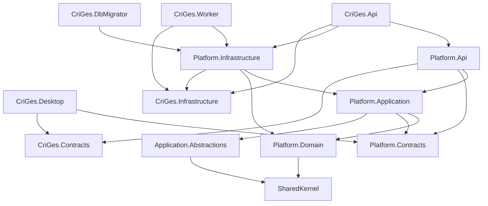

# Estructura inicial de la solución .NET

## 1. Propósito

Este documento convierte la arquitectura técnica de CriGes en una estructura concreta de proyectos .NET.

Define:

- Proyectos y ensamblados.
- Responsabilidad de cada proyecto.
- Referencias permitidas.
- Organización interna.
- Composición de API, Worker y Desktop.
- Persistencia y migraciones.
- Proyectos de prueba.
- Convenciones iniciales de compilación.
- Orden recomendado de creación.

La estructura comienza con Plataforma, pero debe permitir añadir los demás módulos sin reorganizar la solución.

## 2. Principios

1. La solución será un monolito modular.
2. Los procesos desplegables serán hosts sin lógica de negocio.
3. Cada módulo será propietario de su dominio, aplicación, persistencia y contratos.
4. Ningún módulo accederá directamente a la infraestructura interna de otro.
5. `Desktop` solo consumirá contratos HTTP y servicios de presentación.
6. Las dependencias apuntarán hacia Domain y Application.
7. Los elementos compartidos serán pequeños, estables y técnicamente transversales.
8. No se creará un proyecto común para reutilizar entidades de negocio.
9. Las pruebas reflejarán los límites de producción.
10. Las reglas arquitectónicas se comprobarán automáticamente.

## 3. Árbol de la solución

```text
CriGes.sln
├── Directory.Build.props
├── Directory.Build.targets
├── Directory.Packages.props
├── global.json
├── NuGet.config
├── .editorconfig
├── src/
│   ├── Apps/
│   │   ├── CriGes.Api/
│   │   ├── CriGes.Worker/
│   │   └── CriGes.Desktop/
│   ├── Tools/
│   │   └── CriGes.DbMigrator/
│   ├── BuildingBlocks/
│   │   ├── CriGes.SharedKernel/
│   │   ├── CriGes.Application.Abstractions/
│   │   ├── CriGes.Infrastructure/
│   │   └── CriGes.Contracts/
│   └── Modules/
│       └── Platform/
│           ├── CriGes.Modules.Platform.Domain/
│           ├── CriGes.Modules.Platform.Application/
│           ├── CriGes.Modules.Platform.Infrastructure/
│           ├── CriGes.Modules.Platform.Contracts/
│           └── CriGes.Modules.Platform.Api/
├── tests/
│   ├── Architecture/
│   │   └── CriGes.ArchitectureTests/
│   ├── BuildingBlocks/
│   │   └── CriGes.SharedKernel.Tests/
│   ├── Platform/
│   │   ├── CriGes.Modules.Platform.Domain.Tests/
│   │   ├── CriGes.Modules.Platform.Application.Tests/
│   │   ├── CriGes.Modules.Platform.IntegrationTests/
│   │   └── CriGes.Modules.Platform.ContractTests/
│   └── EndToEnd/
│       └── CriGes.Desktop.EndToEndTests/
├── deploy/
├── scripts/
└── docs/
```

Los módulos posteriores repetirán la estructura de Plataforma solo cuando comience su implementación.

## 4. Nombres y espacios de nombres

### Ensamblados

Los ensamblados usarán el patrón:

```text
CriGes.Modules.<Module>.<Layer>
```

Ejemplos:

- `CriGes.Modules.Platform.Domain`
- `CriGes.Modules.Platform.Application`
- `CriGes.Modules.Platform.Infrastructure`
- `CriGes.Modules.Platform.Contracts`
- `CriGes.Modules.Platform.Api`

### Espacios de nombres

El espacio de nombres seguirá la ubicación funcional, no toda la ruta física:

```text
CriGes.Modules.Platform.Domain.Users
CriGes.Modules.Platform.Application.Users.CreateUser
CriGes.Modules.Platform.Infrastructure.Persistence.Users
CriGes.Modules.Platform.Contracts.Users
CriGes.Modules.Platform.Api.Users
```

No se usarán espacios genéricos como `Helpers`, `Utils`, `Managers` o `Common` para ocultar responsabilidades.

## 5. Hosts desplegables

### 5.1 `CriGes.Api`

Proyecto:

```text
Microsoft.NET.Sdk.Web
```

Responsabilidades:

- Arranque de ASP.NET Core.
- Configuración y validación de opciones.
- Registro de módulos.
- Middleware transversal.
- Autenticación y autorización.
- OpenAPI.
- SignalR.
- Salud y observabilidad.
- Composición final de dependencias.

Estructura:

```text
CriGes.Api/
├── Authentication/
├── Authorization/
├── Configuration/
├── Middleware/
│   ├── CorrelationIdMiddleware.cs
│   ├── ExceptionHandlingMiddleware.cs
│   └── MaintenanceModeMiddleware.cs
├── OpenApi/
├── Observability/
├── Program.cs
├── appsettings.json
└── appsettings.Development.json
```

No contendrá:

- Entidades.
- Repositorios.
- Casos de uso.
- Reglas de negocio.
- DTO específicos de módulos.
- Migraciones.

El host descubrirá cada módulo mediante un punto de entrada explícito:

```csharp
services.AddPlatformModule(configuration);
app.MapPlatformEndpoints();
```

### 5.2 `CriGes.Worker`

Proyecto:

```text
Microsoft.NET.Sdk.Worker
```

Responsabilidades:

- Procesamiento de Outbox.
- Trabajos persistidos.
- Caducidades y retenciones.
- Notificaciones diferidas.
- Análisis y mantenimiento de adjuntos.
- Copias y operaciones largas.

Estructura:

```text
CriGes.Worker/
├── Configuration/
├── HostedServices/
│   ├── OutboxProcessor.cs
│   └── PersistentJobProcessor.cs
├── Observability/
├── Program.cs
└── appsettings.json
```

Los `HostedService` coordinan la ejecución, pero delegan cada trabajo al módulo propietario.

### 5.3 `CriGes.Desktop`

Proyecto WPF:

```text
Microsoft.NET.Sdk
TargetFramework: net8.0-windows
UseWPF: true
```

Responsabilidades:

- Shell y navegación.
- Vistas y ViewModels.
- Estado de sesión.
- Cliente HTTP.
- SignalR.
- Protección local de tokens.
- Validación de experiencia de usuario.

Estructura inicial:

```text
CriGes.Desktop/
├── Bootstrap/
├── Navigation/
├── Shell/
├── Authentication/
├── Platform/
│   ├── Users/
│   ├── Roles/
│   ├── Sessions/
│   ├── Configuration/
│   ├── Audit/
│   ├── Notifications/
│   ├── Attachments/
│   ├── Diagnostics/
│   └── Backups/
├── Services/
│   ├── Api/
│   ├── Security/
│   ├── Dialogs/
│   └── Files/
├── Controls/
├── Resources/
├── App.xaml
└── App.xaml.cs
```

Cada funcionalidad de escritorio agrupará:

```text
Users/
├── UserListView.xaml
├── UserListViewModel.cs
├── UserEditView.xaml
├── UserEditViewModel.cs
└── UserNavigation.cs
```

Las vistas no llamarán directamente a `HttpClient`.

### 5.4 `CriGes.DbMigrator`

Proyecto de consola usado durante despliegue:

```text
Microsoft.NET.Sdk
OutputType: Exe
```

Responsabilidades:

- Comprobar conectividad.
- Aplicar migraciones en orden.
- Registrar versión y resultado.
- Ejecutar validaciones posteriores.
- Fallar con un código de salida no cero.

No será invocado por Desktop ni aplicará migraciones implícitamente al arrancar API.

## 6. Building blocks

### 6.1 `CriGes.SharedKernel`

Contiene únicamente primitivas de dominio estables:

```text
CriGes.SharedKernel/
├── Domain/
│   ├── Entity.cs
│   ├── AggregateRoot.cs
│   ├── DomainEvent.cs
│   └── DomainException.cs
├── Results/
│   ├── Error.cs
│   └── Result.cs
└── Time/
    └── SystemTimeAbstraction.cs
```

Puede incluir:

- Tipos base sin dependencia tecnológica.
- Resultado tipado.
- Contrato de evento de dominio.
- Abstracción mínima de reloj.

No puede incluir:

- Entidades como cliente, factura o usuario.
- Repositorios genéricos.
- EF Core.
- Serialización.
- Servicios de infraestructura.
- Reglas pertenecientes a un módulo.

### 6.2 `CriGes.Application.Abstractions`

Contratos técnicos usados por las capas Application:

```text
CriGes.Application.Abstractions/
├── Messaging/
│   ├── ICommand.cs
│   ├── IQuery.cs
│   ├── ICommandHandler.cs
│   └── IQueryHandler.cs
├── Behaviors/
├── Authorization/
├── Transactions/
├── Idempotency/
├── Events/
└── Time/
```

Contendrá abstracciones, no implementaciones de SQL, ASP.NET Core o WPF.

### 6.3 `CriGes.Infrastructure`

Implementaciones técnicas transversales reutilizables:

```text
CriGes.Infrastructure/
├── Persistence/
│   ├── Interceptors/
│   └── Transactions/
├── Security/
├── Encryption/
├── Files/
├── Messaging/
├── Observability/
├── Clock/
└── DependencyInjection.cs
```

Ejemplos:

- Reloj UTC.
- Cifrado de campos.
- Interceptores compartidos de EF Core.
- Correlation ID.
- Implementación de unidad transaccional entre contextos.
- Infraestructura de Outbox e idempotencia.

No contendrá configuraciones de entidades ni repositorios específicos de Plataforma.

### 6.4 `CriGes.Contracts`

Contratos transversales serializables:

```text
CriGes.Contracts/
├── Api/
│   ├── ApiError.cs
│   ├── PageRequest.cs
│   ├── PageResponse.cs
│   └── SortRequest.cs
├── Operations/
└── Versioning/
```

No dependerá de Domain, Application, EF Core o ASP.NET Core.

## 7. Módulo Plataforma

### 7.1 Domain

Estructura por área de dominio:

```text
CriGes.Modules.Platform.Domain/
├── Installation/
├── Users/
├── Sessions/
├── Roles/
├── Company/
├── FiscalYears/
├── Taxation/
├── Smtp/
├── Configuration/
├── Auditing/
├── Notifications/
├── Attachments/
├── Operations/
├── Backups/
└── DependencyInjection.cs
```

Cada agregado agrupará sus elementos:

```text
Users/
├── User.cs
├── UserId.cs
├── UserName.cs
├── CredentialHash.cs
├── UserStatus.cs
├── UserErrors.cs
└── Events/
```

Domain solo referencia `CriGes.SharedKernel`.

`DependencyInjection.cs` no registrará infraestructura; si no aporta nada al dominio se omitirá.

### 7.2 Application

Se organizará por caso de uso:

```text
CriGes.Modules.Platform.Application/
├── Abstractions/
│   ├── Persistence/
│   ├── Security/
│   ├── Files/
│   ├── Notifications/
│   └── Backups/
├── Installation/
│   └── InitializePlatform/
├── Authentication/
│   ├── Login/
│   ├── RefreshSession/
│   ├── Logout/
│   └── ChangePassword/
├── Users/
│   ├── CreateUser/
│   ├── UpdateUser/
│   ├── DeactivateUser/
│   ├── ReactivateUser/
│   ├── UnlockUser/
│   ├── ResetPassword/
│   ├── GetUser/
│   └── SearchUsers/
├── Roles/
├── Sessions/
├── Configuration/
├── Auditing/
├── Notifications/
├── Attachments/
├── Diagnostics/
├── Backups/
└── DependencyInjection.cs
```

Una operación de escritura tendrá normalmente:

```text
CreateUser/
├── CreateUserCommand.cs
├── CreateUserHandler.cs
├── CreateUserValidator.cs
└── CreateUserResult.cs
```

Una consulta tendrá:

```text
SearchUsers/
├── SearchUsersQuery.cs
├── SearchUsersHandler.cs
└── UserListItem.cs
```

Application referencia:

- `CriGes.Modules.Platform.Domain`.
- `CriGes.Modules.Platform.Contracts` cuando use contratos estables.
- `CriGes.Application.Abstractions`.
- `CriGes.SharedKernel`.

### 7.3 Infrastructure

Estructura:

```text
CriGes.Modules.Platform.Infrastructure/
├── Persistence/
│   ├── PlatformDbContext.cs
│   ├── Configurations/
│   ├── Repositories/
│   ├── Queries/
│   ├── Migrations/
│   ├── Seed/
│   └── PlatformDbContextFactory.cs
├── Authentication/
├── Authorization/
├── Encryption/
├── Smtp/
├── Notifications/
├── Attachments/
├── Antivirus/
├── Diagnostics/
├── Backups/
├── Jobs/
├── Outbox/
└── DependencyInjection.cs
```

Infrastructure:

- Implementa puertos de Application.
- Configura EF Core mediante Fluent API.
- Mantiene las migraciones del esquema `platform`.
- No expone `DbContext` a otros módulos.
- No recibe llamadas directas desde Desktop.

### 7.4 Contracts

Contiene contratos públicos de Plataforma:

```text
CriGes.Modules.Platform.Contracts/
├── Installation/
├── Authentication/
├── Users/
├── Roles/
├── Sessions/
├── Company/
├── FiscalYears/
├── Taxation/
├── Numbering/
├── Smtp/
├── Configuration/
├── Audit/
├── Notifications/
├── Attachments/
├── Diagnostics/
├── Backups/
└── Events/
```

Puede contener:

- Peticiones y respuestas HTTP.
- DTO paginados específicos.
- Enumeraciones del contrato.
- Eventos de integración públicos.

No contiene:

- Entidades de dominio.
- Interfaces de repositorio.
- Tipos de EF Core.
- Servicios de aplicación.
- Datos secretos.

Los contratos se diseñarán para serialización y compatibilidad, no como copia automática de entidades.

### 7.5 Api

Adaptador HTTP del módulo:

```text
CriGes.Modules.Platform.Api/
├── Endpoints/
│   ├── Installation/
│   ├── Authentication/
│   ├── Users/
│   ├── Roles/
│   ├── Sessions/
│   ├── Configuration/
│   ├── Audit/
│   ├── Notifications/
│   ├── Attachments/
│   ├── Diagnostics/
│   └── Backups/
├── Authorization/
├── SignalR/
├── OpenApi/
├── PlatformModule.cs
└── PlatformEndpoints.cs
```

Cada endpoint:

- Valida aspectos de transporte.
- Convierte el contrato HTTP en comando o consulta.
- Invoca un único caso de uso.
- Traduce el resultado a HTTP.
- No accede a EF Core.
- No contiene reglas de negocio.

## 8. Dependencias permitidas



### Matriz

| Proyecto | Puede referenciar |
|---|---|
| `Platform.Domain` | `SharedKernel` |
| `Platform.Application` | `Platform.Domain`, `Platform.Contracts`, `Application.Abstractions`, `SharedKernel` |
| `Platform.Infrastructure` | `Platform.Application`, `Platform.Domain`, `Platform.Contracts`, `Infrastructure` |
| `Platform.Api` | `Platform.Application`, `Platform.Contracts`, `Contracts` |
| `Desktop` | `Platform.Contracts`, `Contracts` |
| `Api` | Adaptadores API, infraestructuras de módulos y building blocks de host |
| `Worker` | Infraestructuras de módulos y building blocks de host |
| `DbMigrator` | Infraestructuras de módulos |

### Dependencias prohibidas

- Domain hacia cualquier otra capa del módulo.
- Application hacia Infrastructure o Api.
- Contracts hacia Domain o Application.
- Desktop hacia Application, Infrastructure o Domain.
- Un módulo hacia `Infrastructure` de otro módulo.
- Un módulo hacia tablas o `DbContext` de otro módulo.
- Tests unitarios hacia infraestructura cuando prueben Domain.

## 9. Comunicación entre módulos

Cuando existan más módulos:

### Síncrona

Se usarán contratos públicos de aplicación definidos por el módulo proveedor.

Ejemplo:

```text
Billing.Application
    -> Customers.Contracts
```

El contrato no permitirá modificar directamente agregados del proveedor.

### Asíncrona

Se usarán eventos de integración:

```text
Platform.Contracts.Events.UserDeactivated
```

Los eventos:

- Son inmutables.
- Incluyen identificador y fecha UTC.
- Se publican mediante Outbox.
- Tienen versión.
- No contienen secretos.

### Prohibido

- Referenciar entidades de otro módulo.
- Compartir repositorios.
- Hacer joins EF entre contextos como mecanismo de escritura.
- Invocar controladores o endpoints internamente.

## 10. Persistencia y migraciones

### DbContext

Plataforma tendrá:

```text
PlatformDbContext
```

Características:

- Esquema predeterminado `platform`.
- Configuración Fluent API.
- `DbSet` internos cuando sea posible.
- Conversión explícita de objetos de valor.
- `rowversion` para concurrencia.
- Interceptores de marcas temporales y Outbox.

Las consultas de lectura pueden usar proyecciones específicas sin reconstruir agregados cuando no modifican estado.

### Migraciones

Las migraciones residirán en:

```text
CriGes.Modules.Platform.Infrastructure/Persistence/Migrations
```

Convención de nombre:

```text
YYYYMMDDHHmm_Descripcion
```

Ejemplo:

```text
202606231800_CreatePlatformSchema
```

Reglas:

1. Una migración pertenece a un único módulo.
2. No se editará una migración ya desplegada.
3. Las migraciones no incluirán contraseñas ni secretos fijos.
4. Los datos semilla serán estables e identificables.
5. Los cambios destructivos requerirán migración por etapas.
6. `DbMigrator` las aplicará en el orden declarado.
7. API y Worker comprobarán compatibilidad, pero no migrarán.

### Diseño en tiempo de compilación

`PlatformDbContextFactory` permitirá generar migraciones sin arrancar API.

La cadena de desarrollo se obtendrá de configuración local segura; no se incluirá en el repositorio.

## 11. Inyección de dependencias

Cada proyecto expondrá un único método de registro público cuando lo necesite:

```csharp
services.AddPlatformApplication();
services.AddPlatformInfrastructure(configuration);
services.AddPlatformApi();
```

Reglas:

- El registro interno será `internal` siempre que sea posible.
- Los hosts deciden qué módulos cargar.
- Application no usa un contenedor como localizador de servicios.
- No se resolverán servicios manualmente desde `IServiceProvider` salvo fábricas justificadas.
- Los servicios con estado por petición serán `Scoped`.
- Los servicios puros y sin estado podrán ser `Singleton`.
- Los clientes externos usarán `HttpClientFactory`.

## 12. Comandos, consultas y pipeline

La solución usará un dispatcher explícito mediante las abstracciones propias o una biblioteca aprobada.

El pipeline podrá incluir, por este orden:

1. Correlation ID.
2. Autorización.
3. Validación.
4. Idempotencia cuando corresponda.
5. Transacción.
6. Ejecución.
7. Outbox.
8. Auditoría.
9. Métricas.

No todos los comportamientos se aplican a todas las consultas.

Los handlers:

- Tienen una única responsabilidad funcional.
- No devuelven entidades de dominio al transporte.
- No abren conexiones externas dentro de una transacción SQL.
- Reciben reloj, identidad y puertos mediante constructor.

## 13. API y contratos

Los endpoints se implementarán inicialmente con Minimal APIs agrupadas:

```csharp
var group = routes.MapGroup("/api/v1/users");
```

La elección no impide usar controladores cuando aporten una ventaja concreta, pero no se mezclarán estilos arbitrariamente dentro de una misma área.

Convenciones:

- Un archivo de endpoint por operación.
- Nombres alineados con el contrato funcional.
- OpenAPI obligatorio.
- `ProblemDetails` centralizado.
- Autorización mediante políticas.
- Versionado por ruta.
- DTO de entrada inmutables.
- Cancelación propagada mediante `CancellationToken`.

## 14. Desktop y MVVM

### Servicios

El cliente HTTP se dividirá por contrato funcional:

```text
IAuthenticationApi
IUsersApi
IRolesApi
IConfigurationApi
IAuditApi
INotificationsApi
IAttachmentsApi
IBackupsApi
```

Una infraestructura común gestionará:

- URL base.
- `Authorization`.
- Refresh coordinado.
- Correlation ID.
- `X-Client-Version`.
- `X-Device-Id`.
- `ETag`.
- `ProblemDetails`.

### ViewModels

- No contienen reglas de negocio del servidor.
- Exponen estado de carga, vacío y error.
- Usan comandos asíncronos.
- No bloquean el hilo de interfaz.
- Cancelan operaciones al abandonar una pantalla cuando proceda.
- Conservan filtros mediante un servicio de navegación.

### Tokens

- Access token en memoria.
- Refresh token protegido mediante DPAPI.
- Limpieza al cerrar sesión.
- Nunca se escriben en logs.

## 15. Worker

El Worker no duplicará casos de uso.

Cada trabajo se representa mediante un contrato persistido que identifica:

- Tipo.
- Versión.
- Carga.
- Intentos.
- Próxima ejecución.
- Bloqueo.
- Correlation ID.

Los procesadores específicos se registran desde Infrastructure del módulo.

Los trabajos deberán:

- Ser idempotentes.
- Respetar cancelación.
- Renovar su bloqueo cuando sean largos.
- Registrar resultado sin secretos.
- Diferenciar fallo transitorio y definitivo.

## 16. Configuración

### Ficheros

- `appsettings.json`: valores no secretos.
- `appsettings.Development.json`: valores locales no sensibles.
- Variables de entorno o almacén protegido: secretos.
- `launchSettings.json`: solo configuración de desarrollo segura.

### Opciones tipadas

Ejemplos:

```text
DatabaseOptions
JwtOptions
FileStorageOptions
AntivirusOptions
SmtpInfrastructureOptions
BackupOptions
WorkerOptions
```

Cada opción:

- Tendrá sección propia.
- Se validará al arrancar.
- No se inyectará como `IConfiguration` en servicios de dominio o aplicación.

La configuración funcional editable por usuarios permanecerá en base de datos y no se confundirá con configuración técnica.

## 17. Gestión de paquetes

Se usará administración central:

```text
Directory.Packages.props
```

Reglas:

1. Los proyectos no fijan versiones individualmente.
2. No se añade un paquete sin justificar su responsabilidad.
3. Domain minimiza dependencias externas.
4. Se bloquean versiones vulnerables.
5. Las actualizaciones se prueban de forma agrupada y controlada.
6. No se incorpora una biblioteca para una abstracción trivial.

Familias previstas:

- ASP.NET Core y OpenAPI.
- EF Core para SQL Server.
- Validación.
- Logs estructurados.
- OpenTelemetry.
- SignalR.
- Pruebas y aserciones.
- Pruebas de arquitectura.
- Automatización WPF.

Las bibliotecas concretas y sus versiones se decidirán al crear la solución, respetando .NET 8 y soporte vigente.

## 18. Configuración común de compilación

`Directory.Build.props` establecerá:

```xml
<PropertyGroup>
  <TargetFramework>net8.0</TargetFramework>
  <ImplicitUsings>enable</ImplicitUsings>
  <Nullable>enable</Nullable>
  <TreatWarningsAsErrors>true</TreatWarningsAsErrors>
  <EnforceCodeStyleInBuild>true</EnforceCodeStyleInBuild>
  <Deterministic>true</Deterministic>
  <ContinuousIntegrationBuild Condition="'$(CI)' == 'true'">true</ContinuousIntegrationBuild>
</PropertyGroup>
```

Excepciones:

- Desktop usará `net8.0-windows`.
- Proyectos que generen código podrán excluir advertencias concretas de forma documentada.
- Las advertencias no se desactivarán globalmente para resolver un único caso.

`Directory.Build.targets` podrá añadir comprobaciones compartidas sin ejecutar tareas destructivas.

## 19. Análisis de código

Desde el inicio se activarán:

- Nullable reference types.
- Analizadores del SDK.
- Reglas de estilo.
- Detección de secretos en CI.
- Auditoría de paquetes.
- Formato verificable.

Se priorizarán:

- Corrección.
- Seguridad.
- Uso apropiado de cancelación.
- Errores de asincronía.
- Exposición accidental de datos.

No se impondrá un conjunto de estilo tan ruidoso que oculte defectos relevantes.

## 20. Proyectos de prueba

### Domain tests

Prueban:

- Agregados.
- Objetos de valor.
- Transiciones.
- Invariantes.
- Eventos de dominio.
- Reglas `RN`.

Solo referencian Domain y utilidades de prueba mínimas.

### Application tests

Prueban:

- Handlers.
- Validadores.
- Autorización de caso de uso.
- Orquestación.
- Errores.

Usan dobles de los puertos, no EF Core en memoria.

### Integration tests

Prueban:

- SQL Server real.
- EF Core.
- Restricciones.
- Transacciones.
- Outbox.
- Cifrado.
- Archivos.
- Worker.
- Copias y restauración.

### Contract tests

Arrancan API en memoria o proceso aislado y verifican:

- HTTP.
- OpenAPI.
- Autenticación.
- Autorización.
- Errores.
- Concurrencia.
- Idempotencia.

### Architecture tests

Impedirán al menos:

- Dependencias de Domain hacia infraestructura.
- Application hacia Infrastructure.
- Contracts hacia capas internas.
- Desktop hacia módulos internos.
- Referencias entre infraestructuras de módulos.
- Endpoints que dependan de `DbContext`.
- Tipos Domain expuestos por Contracts.

### End-to-end

Ejecutan Desktop contra el entorno completo para los escenarios críticos `PLT-TP`.

## 21. Utilidades de prueba

Las utilidades se mantendrán cerca de las pruebas que las usan.

Solo se creará un proyecto común de testing cuando exista reutilización real y estable.

Patrones previstos:

```text
PlatformTestData
PlatformApiFactory
SqlServerFixture
FakeClock
TestUser
StubAntivirus
StubSmtpServer
TemporaryFileRepository
```

No se compartirán builders que permitan crear agregados en estados imposibles salvo pruebas explícitas de persistencia corrupta.

## 22. Friend assemblies

Se evitará `InternalsVisibleTo` generalizado.

Podrá utilizarse para:

- Pruebas del mismo módulo.
- Proxies de EF Core cuando sea imprescindible.

No se utilizará para comunicar módulos ni para saltarse contratos públicos.

## 23. Versionado

La solución tendrá una versión de producto única.

Los ensamblados:

- Compartirán versión base.
- Incluirán versión informativa con commit en CI.
- No se versionarán de forma independiente en la primera etapa.

Los contratos HTTP y eventos sí tendrán compatibilidad explícita:

- API `/api/v1`.
- Eventos con versión de esquema.
- Migraciones con historial propio.

## 24. CI inicial

El pipeline mínimo ejecutará:

1. Restauración bloqueada de paquetes.
2. Compilación Release.
3. Formato y analizadores.
4. Pruebas unitarias.
5. Pruebas de arquitectura.
6. Pruebas de integración con SQL Server.
7. Pruebas de contrato.
8. Generación y comparación de OpenAPI.
9. Auditoría de dependencias.
10. Publicación de resultados y cobertura.

Las pruebas E2E de WPF se ejecutarán en un agente Windows interactivo independiente.

## 25. Archivos raíz

### `global.json`

Fijará una familia compatible del SDK .NET 8 y permitirá solo la política de actualización acordada.

### `NuGet.config`

Definirá:

- Fuentes aprobadas.
- Mapeo de paquetes si se habilitan fuentes privadas.
- Comportamiento de restauración.

No contendrá credenciales.

### `.editorconfig`

Definirá:

- UTF-8.
- Final de línea.
- Sangría.
- Convenciones de C#.
- Severidad de analizadores.

### `.gitignore`

Excluirá:

- `bin/` y `obj/`.
- Secretos locales.
- Tokens.
- Bases y copias locales.
- Adjuntos temporales.
- Resultados voluminosos de pruebas.

### `README.md`

Explicará:

- Requisitos.
- Configuración local.
- Restauración y compilación.
- Migraciones.
- Ejecución de API, Worker y Desktop.
- Pruebas.

## 26. Carpetas operativas

### `deploy`

Contendrá recursos versionables:

```text
deploy/
├── windows/
├── sql/
├── configuration/
└── README.md
```

No contendrá certificados, contraseñas ni copias reales.

### `scripts`

Scripts idempotentes para:

- Preparar desarrollo.
- Compilar.
- Ejecutar pruebas.
- Publicar.
- Invocar migraciones.

Los scripts no contendrán secretos ni rutas personales fijas.

## 27. Orden de creación

### Etapa 1: base

1. Archivos raíz y solución.
2. Building blocks.
3. Proyectos Domain, Application, Contracts, Infrastructure y Api de Plataforma.
4. Hosts API, Worker y Desktop.
5. DbMigrator.
6. Proyectos de prueba.

### Etapa 2: esqueleto ejecutable

1. Registro de módulos.
2. Configuración tipada.
3. Observabilidad.
4. Health checks.
5. Gestión común de errores.
6. Conexión SQL Server.
7. Primera migración vacía del esquema `platform`.
8. Shell WPF y cliente de salud.

### Etapa 3: primera rebanada vertical

Se recomienda implementar `PLT-CU-001 - Inicializar el sistema` de extremo a extremo:

1. Dominio.
2. Comando y validación.
3. Persistencia.
4. Contrato.
5. Endpoint.
6. Pantalla.
7. Pruebas `PLT-TP-001` a `PLT-TP-005`.

Después se continuará con autenticación y sesiones.

El desglose técnico de esta primera rebanada está definido en [Backlog técnico de la primera rebanada vertical](07-backlog-tecnico-primera-rebanada.md).

La secuencia concreta para crear físicamente la solución y sus proyectos está definida en [Plan de creación física de la solución](08-plan-creacion-fisica-solucion.md).

## 28. Criterios de aceptación

1. La solución compila desde un clon limpio.
2. API, Worker, Desktop y DbMigrator arrancan con configuración de desarrollo.
3. Domain no tiene dependencias tecnológicas.
4. Desktop no referencia capas internas de módulos.
5. Plataforma puede registrarse o retirarse mediante sus puntos de composición.
6. La base se crea únicamente mediante DbMigrator.
7. La primera migración crea el esquema `platform`.
8. OpenAPI se genera desde el host.
9. Health checks informan del estado básico.
10. Las pruebas unitarias, arquitectura, integración y contrato se ejecutan por separado.
11. La configuración no contiene secretos versionados.
12. Las referencias prohibidas fallan automáticamente.
13. Los nombres de proyecto y namespaces siguen este documento.
14. La estructura permite añadir un nuevo módulo sin modificar los módulos existentes.
15. La primera rebanada vertical tiene trazabilidad con caso de uso, reglas y plan de pruebas.

## 29. Decisiones diferidas

- Biblioteca concreta de mediación o dispatcher propio.
- Biblioteca MVVM concreta.
- Framework de automatización WPF.
- Herramienta de pruebas de arquitectura.
- Estrategia local de SQL Server para desarrollo.
- Biblioteca de validación.
- Generación manual o automática de clientes HTTP.
- Herramienta exacta de comparación OpenAPI.
- Formato final del instalador Desktop.
- Herramienta de despliegue de servicios Windows.

Estas decisiones no alteran los límites de proyectos definidos aquí.

Cuando cualquiera de estas decisiones se cierre, deberá registrarse como ADR nuevo o como reemplazo explícito de una decisión existente en [Registro de decisiones arquitectónicas](adr/README.md).
