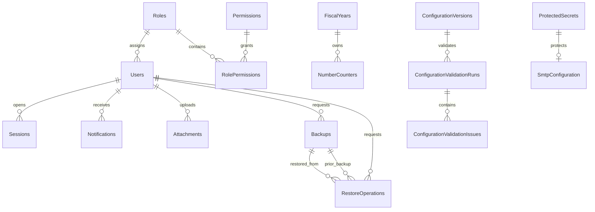

# Modelo físico de datos: Fase 0 - Plataforma

## 1. Propósito

Este documento traduce el modelo de dominio de Plataforma a un diseño físico inicial para SQL Server.

Define:

- Esquemas y convenciones.
- Tablas y columnas.
- Claves y relaciones.
- Índices.
- Restricciones.
- Concurrencia.
- Cifrado.
- Auditoría.
- Outbox, Inbox y trabajos.
- Retención y borrado.

No contiene todavía scripts de migración definitivos.

## 2. Plataforma de persistencia

- Motor: SQL Server.
- ORM: Entity Framework Core 8.
- Esquema: `platform`.
- Intercalación recomendada para datos de negocio: una intercalación española moderna, insensible a mayúsculas y acentos cuando corresponda.
- Identificadores: `uniqueidentifier`.
- Marcas temporales: `datetime2(3)` en UTC.
- Fechas puras: `date`.
- Concurrencia: `rowversion`.
- Booleanos: `bit`.
- JSON: `nvarchar(max)` con restricción `ISJSON`.
- Hashes SHA-256 y HMAC: `binary(32)`.

La intercalación definitiva se validará antes de crear la primera migración.

## 3. Convenciones

### Claves

- PK: `PK_<Tabla>`.
- FK: `FK_<Tabla>_<Referenciada>`.
- UK: `UX_<Tabla>_<Columnas>`.
- Índice: `IX_<Tabla>_<Columnas>`.
- Check: `CK_<Tabla>_<Regla>`.

### Nombres

- Tablas en plural.
- Columnas en PascalCase.
- Fechas UTC terminan en `Utc`.
- Fechas puras no llevan sufijo UTC.
- Valores cifrados terminan en `Ciphertext`.
- Valores de búsqueda protegida terminan en `SearchHmac`.

### Borrado

Las relaciones usarán por defecto:

- `ON DELETE NO ACTION`.

No se utilizará cascada sobre:

- Usuarios.
- Roles.
- Auditoría.
- Sesiones.
- Notificaciones.
- Adjuntos.
- Copias.

## 4. Catálogo de tablas

| Área | Tabla |
|---|---|
| Inicialización | `platform.Installations` |
| Identidad | `platform.Users` |
| Identidad | `platform.ReservedUserNames` |
| Identidad | `platform.Sessions` |
| Autorización | `platform.Roles` |
| Autorización | `platform.Permissions` |
| Autorización | `platform.RolePermissions` |
| Configuración | `platform.Companies` |
| Configuración | `platform.FiscalYears` |
| Configuración | `platform.NumberCounters` |
| Configuración | `platform.TaxRates` |
| Configuración | `platform.FiscalConfiguration` |
| Configuración | `platform.FiscalReasons` |
| Configuración | `platform.SmtpConfiguration` |
| Configuración | `platform.SmtpTestResults` |
| Configuración | `platform.ConfigurationVersions` |
| Configuración | `platform.ConfigurationValidationRuns` |
| Configuración | `platform.ConfigurationValidationIssues` |
| Auditoría | `platform.AuditEvents` |
| Notificaciones | `platform.Notifications` |
| Archivos | `platform.Attachments` |
| Archivos | `platform.AttachmentPolicies` |
| Operaciones | `platform.TechnicalIncidents` |
| Copias | `platform.Backups` |
| Copias | `platform.RestoreOperations` |
| Mensajería | `platform.OutboxMessages` |
| Mensajería | `platform.InboxMessages` |
| Trabajos | `platform.BackgroundJobs` |
| Seguridad | `platform.ProtectedSecrets` |

## 5. Diagrama lógico



Las referencias polimórficas de auditoría, notificaciones y adjuntos no se representan mediante FK a todas las entidades del sistema.

## 6. Inicialización

### `platform.Installations`

| Columna | Tipo | Nulo | Notas |
|---|---|---|---|
| `InstallationId` | `uniqueidentifier` | No | PK |
| `SingletonKey` | `tinyint` | No | Siempre `1` |
| `Status` | `tinyint` | No | Enum |
| `StartedAtUtc` | `datetime2(3)` | Sí | |
| `CompletedAtUtc` | `datetime2(3)` | Sí | |
| `InitialAdministratorUserId` | `uniqueidentifier` | Sí | FK diferida a Users |
| `ProductVersion` | `nvarchar(32)` | No | |
| `FailureCode` | `nvarchar(100)` | Sí | Sin secretos |
| `CreatedAtUtc` | `datetime2(3)` | No | |
| `RowVersion` | `rowversion` | No | |

Restricciones:

- `PK_Installations`.
- `UX_Installations_SingletonKey`.
- `CK_Installations_SingletonKey`: `SingletonKey = 1`.
- `CK_Installations_Status`: valores permitidos.

La FK al administrador se añadirá tras crear la tabla de usuarios o mediante migración ordenada.

## 7. Roles y permisos

### `platform.Roles`

| Columna | Tipo | Nulo | Notas |
|---|---|---|---|
| `RoleId` | `uniqueidentifier` | No | PK |
| `Name` | `nvarchar(100)` | No | |
| `NormalizedName` | `nvarchar(100)` | No | Comparación única |
| `RoleType` | `tinyint` | No | Base o personalizado |
| `Status` | `tinyint` | No | Activo o inactivo |
| `IsProtected` | `bit` | No | Roles base |
| `PermissionVersion` | `bigint` | No | Se incrementa al cambiar permisos |
| `CreatedAtUtc` | `datetime2(3)` | No | |
| `ModifiedAtUtc` | `datetime2(3)` | No | |
| `CreatedByUserId` | `uniqueidentifier` | Sí | Nulo durante inicialización |
| `ModifiedByUserId` | `uniqueidentifier` | Sí | |
| `RowVersion` | `rowversion` | No | |

Índices:

- `UX_Roles_NormalizedName`.
- `IX_Roles_Status`.

Checks:

- `RoleType` y `Status` dentro de catálogo.
- `IsProtected = 1` implica `RoleType = Base`.

Las prohibiciones de modificar o desactivar roles base se aplicarán en dominio y aplicación. Opcionalmente se reforzarán con trigger defensivo.

### `platform.Permissions`

| Columna | Tipo | Nulo | Notas |
|---|---|---|---|
| `PermissionId` | `uniqueidentifier` | No | PK |
| `Code` | `nvarchar(150)` | No | Ej. `Billing.Issue` |
| `Module` | `nvarchar(80)` | No | |
| `Action` | `nvarchar(80)` | No | |
| `Description` | `nvarchar(300)` | No | |
| `IsSystemReserved` | `bit` | No | |
| `CreatedAtUtc` | `datetime2(3)` | No | |

Índices:

- `UX_Permissions_Code`.
- `IX_Permissions_Module_Action`.

### `platform.RolePermissions`

| Columna | Tipo | Nulo | Notas |
|---|---|---|---|
| `RoleId` | `uniqueidentifier` | No | PK/FK |
| `PermissionId` | `uniqueidentifier` | No | PK/FK |
| `GrantedAtUtc` | `datetime2(3)` | No | |
| `GrantedByUserId` | `uniqueidentifier` | Sí | |

Claves:

- PK compuesta `(RoleId, PermissionId)`.
- FK a Roles y Permissions.

La regla que impide roles personalizados sin permisos se valida al confirmar el comando, no durante una edición temporal.

## 8. Usuarios

### `platform.Users`

| Columna | Tipo | Nulo | Notas |
|---|---|---|---|
| `UserId` | `uniqueidentifier` | No | PK |
| `FullName` | `nvarchar(200)` | No | |
| `UserName` | `nvarchar(100)` | No | Presentación |
| `NormalizedUserName` | `nvarchar(100)` | No | Unicidad |
| `PhoneCiphertext` | `varbinary(max)` | Sí | Cifrado autenticado |
| `PhoneSearchHmac` | `binary(32)` | Sí | Búsqueda opcional |
| `RoleId` | `uniqueidentifier` | No | FK |
| `Status` | `tinyint` | No | Activo, bloqueado, desactivado |
| `PasswordHash` | `nvarchar(1000)` | No | Formato versionado |
| `SecurityVersion` | `bigint` | No | Invalida tokens |
| `FailedLoginCount` | `smallint` | No | Default 0 |
| `BlockedUntilUtc` | `datetime2(3)` | Sí | |
| `LastSuccessfulLoginUtc` | `datetime2(3)` | Sí | |
| `PasswordChangedAtUtc` | `datetime2(3)` | No | |
| `CreatedAtUtc` | `datetime2(3)` | No | |
| `DeactivatedAtUtc` | `datetime2(3)` | Sí | |
| `DeactivationReason` | `nvarchar(500)` | Sí | |
| `CreatedByUserId` | `uniqueidentifier` | Sí | Inicialización |
| `ModifiedAtUtc` | `datetime2(3)` | No | |
| `ModifiedByUserId` | `uniqueidentifier` | Sí | |
| `RowVersion` | `rowversion` | No | |

Índices:

- `UX_Users_NormalizedUserName`.
- `IX_Users_RoleId_Status`.
- `IX_Users_Status_BlockedUntilUtc`.
- `IX_Users_PhoneSearchHmac` filtrado cuando no sea nulo.

Checks:

- `FailedLoginCount >= 0`.
- Estado dentro de catálogo.
- Si estado es `Bloqueado`, `BlockedUntilUtc` no es nulo.
- Si estado es `Desactivado`, `DeactivatedAtUtc` y motivo no son nulos.

No se almacena:

- Contraseña original.
- Historial de contraseñas en la primera versión.
- Tokens en texto.

### `platform.ReservedUserNames`

Garantiza que un nombre no pueda reutilizarse aunque el usuario quede desactivado.

| Columna | Tipo | Nulo | Notas |
|---|---|---|---|
| `NormalizedUserName` | `nvarchar(100)` | No | PK |
| `FirstUserId` | `uniqueidentifier` | No | |
| `ReservedAtUtc` | `datetime2(3)` | No | |

La creación del usuario inserta en esta tabla y en `Users` dentro de la misma transacción.

No se elimina ningún registro.

## 9. Sesiones

### `platform.Sessions`

| Columna | Tipo | Nulo | Notas |
|---|---|---|---|
| `SessionId` | `uniqueidentifier` | No | PK |
| `UserId` | `uniqueidentifier` | No | FK |
| `Status` | `tinyint` | No | |
| `StartedAtUtc` | `datetime2(3)` | No | |
| `LastActivityAtUtc` | `datetime2(3)` | No | |
| `IdleExpiresAtUtc` | `datetime2(3)` | No | |
| `ClosedAtUtc` | `datetime2(3)` | Sí | |
| `CloseReason` | `nvarchar(300)` | Sí | |
| `OriginIp` | `nvarchar(64)` | Sí | IPv4/IPv6 |
| `DeviceId` | `nvarchar(200)` | Sí | |
| `ClientVersion` | `nvarchar(32)` | Sí | |
| `RefreshTokenHash` | `binary(32)` | No | SHA-256/HMAC del token |
| `RefreshTokenExpiresAtUtc` | `datetime2(3)` | No | |
| `SecurityVersion` | `bigint` | No | Copia de Users |
| `RolePermissionVersion` | `bigint` | No | Copia de Roles |
| `CreatedAtUtc` | `datetime2(3)` | No | |
| `RowVersion` | `rowversion` | No | |

Índices:

- `UX_Sessions_UserId_Active` único filtrado:
  - `(UserId)` donde `Status = Activa`.
- `UX_Sessions_RefreshTokenHash`.
- `IX_Sessions_IdleExpiresAtUtc_Status`.
- `IX_Sessions_UserId_StartedAtUtc`.

Checks:

- Una sesión activa no tiene `ClosedAtUtc`.
- Una sesión cerrada, caducada o revocada tiene `ClosedAtUtc`.
- Fechas de expiración posteriores al inicio.

El estado `Activa` deberá tener un valor constante conocido por la migración para construir el índice filtrado.

## 10. Empresa

### `platform.Companies`

Existirá una única fila.

| Columna | Tipo | Nulo | Notas |
|---|---|---|---|
| `CompanyId` | `uniqueidentifier` | No | PK |
| `SingletonKey` | `tinyint` | No | Siempre 1 |
| `LegalName` | `nvarchar(250)` | No | |
| `TradeName` | `nvarchar(250)` | Sí | |
| `TaxIdCiphertext` | `varbinary(max)` | No | NIF cifrado |
| `TaxIdSearchHmac` | `binary(32)` | No | |
| `TaxIdType` | `tinyint` | No | |
| `TaxIdLocked` | `bit` | No | Tras primera factura |
| `AddressLine` | `nvarchar(300)` | No | |
| `PostalCode` | `nvarchar(20)` | No | |
| `City` | `nvarchar(120)` | No | |
| `Region` | `nvarchar(120)` | Sí | |
| `CountryCode` | `char(2)` | No | ISO 3166-1 alpha-2 |
| `PhonePrefix` | `nvarchar(8)` | Sí | |
| `PhoneCiphertext` | `varbinary(max)` | Sí | |
| `PhoneSearchHmac` | `binary(32)` | Sí | |
| `EmailCiphertext` | `varbinary(max)` | Sí | |
| `EmailSearchHmac` | `binary(32)` | Sí | |
| `Website` | `nvarchar(300)` | Sí | |
| `CommercialRegistryText` | `nvarchar(1000)` | Sí | |
| `LogoAttachmentId` | `uniqueidentifier` | Sí | FK diferida |
| `BankAlias` | `nvarchar(100)` | Sí | |
| `IbanCiphertext` | `varbinary(max)` | No | |
| `IbanSearchHmac` | `binary(32)` | No | |
| `Bic` | `nvarchar(11)` | Sí | |
| `LanguageCode` | `nvarchar(10)` | No | `es-ES` |
| `CurrencyCode` | `char(3)` | No | `EUR` |
| `TimeZoneId` | `nvarchar(100)` | No | `Europe/Madrid` |
| `CreatedAtUtc` | `datetime2(3)` | No | |
| `ModifiedAtUtc` | `datetime2(3)` | No | |
| `ModifiedByUserId` | `uniqueidentifier` | Sí | |
| `RowVersion` | `rowversion` | No | |

Restricciones:

- `UX_Companies_SingletonKey`.
- `CK_Companies_SingletonKey`: `SingletonKey = 1`.
- `UX_Companies_TaxIdSearchHmac`.
- `UX_Companies_IbanSearchHmac`.
- Checks para idioma, moneda y formato básico de país.

Los valores cifrados no se indexan directamente.

## 11. Ejercicios

### `platform.FiscalYears`

| Columna | Tipo | Nulo | Notas |
|---|---|---|---|
| `FiscalYearId` | `uniqueidentifier` | No | PK |
| `Year` | `smallint` | No | |
| `StartDate` | `date` | No | |
| `EndDate` | `date` | No | |
| `Status` | `tinyint` | No | Abierto/Cerrado |
| `CreatedAtUtc` | `datetime2(3)` | No | |
| `CreatedByUserId` | `uniqueidentifier` | No | FK |
| `ClosedAtUtc` | `datetime2(3)` | Sí | Lo completa Contabilidad |
| `ClosedByUserId` | `uniqueidentifier` | Sí | |
| `RowVersion` | `rowversion` | No | |

Índices y checks:

- `UX_FiscalYears_Year`.
- `IX_FiscalYears_Status`.
- `CK_FiscalYears_DateRange`: `StartDate <= EndDate`.

SQL Server no puede expresar fácilmente la ausencia general de solapamientos mediante un check. Se validará en la aplicación y en una transacción con nivel apropiado.

## 12. Contadores

### `platform.NumberCounters`

| Columna | Tipo | Nulo | Notas |
|---|---|---|---|
| `CounterId` | `uniqueidentifier` | No | PK |
| `CounterCode` | `nvarchar(100)` | No | Identificador estable |
| `Scope` | `tinyint` | No | Global, anual, categoría |
| `FiscalYearId` | `uniqueidentifier` | Sí | FK |
| `CategoryKey` | `nvarchar(100)` | Sí | Para catálogo |
| `FormatPattern` | `nvarchar(100)` | No | Fijo |
| `LastValue` | `bigint` | No | Default 0 |
| `NextValue` | `bigint` | No | Default 1 |
| `LastAssignedAtUtc` | `datetime2(3)` | Sí | |
| `CreatedAtUtc` | `datetime2(3)` | No | |
| `RowVersion` | `rowversion` | No | |

Índices:

- `UX_NumberCounters_Annual` sobre `(CounterCode, FiscalYearId)` filtrado para ámbito anual.
- `UX_NumberCounters_Global` sobre `CounterCode` filtrado para ámbito global.
- `UX_NumberCounters_Category` sobre `(CounterCode, CategoryKey)` filtrado para categoría.

Checks:

- `LastValue >= 0`.
- `NextValue = LastValue + 1`.
- Ámbito anual exige `FiscalYearId`.
- Ámbito categoría exige `CategoryKey`.
- Ámbito global no admite ejercicio ni categoría.

### Reserva atómica

La reserva se implementará mediante procedimiento almacenado o sentencia SQL atómica:

```sql
UPDATE platform.NumberCounters WITH (UPDLOCK, ROWLOCK)
SET
    LastValue = NextValue,
    NextValue = NextValue + 1,
    LastAssignedAtUtc = SYSUTCDATETIME()
OUTPUT inserted.LastValue, inserted.FormatPattern
WHERE CounterId = @CounterId;
```

La operación se ejecuta dentro de la transacción del documento que consume el número.

## 13. Impuestos y configuración fiscal

### `platform.TaxRates`

| Columna | Tipo | Nulo | Notas |
|---|---|---|---|
| `TaxRateId` | `uniqueidentifier` | No | PK |
| `Code` | `nvarchar(50)` | No | |
| `Name` | `nvarchar(120)` | No | |
| `Percentage` | `decimal(7,4)` | No | |
| `ValidFrom` | `date` | No | |
| `ValidTo` | `date` | Sí | |
| `Status` | `tinyint` | No | |
| `HasBeenUsed` | `bit` | No | Optimización, no única fuente |
| `CreatedAtUtc` | `datetime2(3)` | No | |
| `CreatedByUserId` | `uniqueidentifier` | No | |
| `DeactivatedAtUtc` | `datetime2(3)` | Sí | |
| `RowVersion` | `rowversion` | No | |

Índices:

- `UX_TaxRates_Code_ValidFrom`.
- `IX_TaxRates_Status_ValidFrom_ValidTo`.

Checks:

- `Percentage >= 0 AND Percentage <= 100`.
- `ValidTo IS NULL OR ValidTo >= ValidFrom`.

El solapamiento de vigencias se controla en aplicación y transacción serializable por código.

### `platform.FiscalConfiguration`

Existirá una única fila.

| Columna | Tipo | Nulo | Notas |
|---|---|---|---|
| `FiscalConfigurationId` | `uniqueidentifier` | No | PK |
| `SingletonKey` | `tinyint` | No | Siempre 1 |
| `WithholdingPercentage` | `decimal(7,4)` | No | |
| `CreatedAtUtc` | `datetime2(3)` | No | |
| `ModifiedAtUtc` | `datetime2(3)` | No | |
| `ModifiedByUserId` | `uniqueidentifier` | Sí | |
| `RowVersion` | `rowversion` | No | |

Restricciones:

- Singleton.
- Retención entre 0 y 100.

### `platform.FiscalReasons`

| Columna | Tipo | Nulo | Notas |
|---|---|---|---|
| `FiscalReasonId` | `uniqueidentifier` | No | PK |
| `Code` | `nvarchar(50)` | No | |
| `Description` | `nvarchar(500)` | No | |
| `ReasonType` | `tinyint` | No | Exento/No sujeto |
| `Status` | `tinyint` | No | |
| `HasBeenUsed` | `bit` | No | |
| `CreatedAtUtc` | `datetime2(3)` | No | |
| `CreatedByUserId` | `uniqueidentifier` | No | |
| `RowVersion` | `rowversion` | No | |

Índices:

- `UX_FiscalReasons_Code_ReasonType`.
- `IX_FiscalReasons_Status_ReasonType`.

## 14. Secretos protegidos

### `platform.ProtectedSecrets`

Almacena únicamente ciphertext generado por el protector de secretos.

| Columna | Tipo | Nulo | Notas |
|---|---|---|---|
| `SecretId` | `uniqueidentifier` | No | PK |
| `Purpose` | `nvarchar(100)` | No | Contexto criptográfico |
| `Ciphertext` | `varbinary(max)` | No | Incluye nonce/tag según formato |
| `KeyVersion` | `nvarchar(50)` | No | |
| `CreatedAtUtc` | `datetime2(3)` | No | |
| `RotatedAtUtc` | `datetime2(3)` | Sí | |
| `Status` | `tinyint` | No | Activo/retirado |

Índices:

- `IX_ProtectedSecrets_Purpose_Status`.

Reglas:

- Nunca se registra el valor descifrado.
- La clave maestra está fuera de SQL Server.
- La rotación crea un nuevo ciphertext y conserva trazabilidad.

## 15. SMTP

### `platform.SmtpConfiguration`

Existirá una única fila.

| Columna | Tipo | Nulo | Notas |
|---|---|---|---|
| `SmtpConfigurationId` | `uniqueidentifier` | No | PK |
| `SingletonKey` | `tinyint` | No | Siempre 1 |
| `Server` | `nvarchar(255)` | No | |
| `Port` | `int` | No | |
| `SecurityMode` | `tinyint` | No | |
| `UserName` | `nvarchar(255)` | Sí | |
| `PasswordSecretId` | `uniqueidentifier` | Sí | FK |
| `SenderAddress` | `nvarchar(320)` | No | |
| `SenderDisplayName` | `nvarchar(200)` | No | |
| `Status` | `tinyint` | No | |
| `LastSuccessfulTestAtUtc` | `datetime2(3)` | Sí | |
| `LastTestResultCode` | `nvarchar(100)` | Sí | |
| `CreatedAtUtc` | `datetime2(3)` | No | |
| `ModifiedAtUtc` | `datetime2(3)` | No | |
| `ModifiedByUserId` | `uniqueidentifier` | Sí | |
| `RowVersion` | `rowversion` | No | |

Restricciones:

- Singleton.
- Puerto entre 1 y 65535.
- Estado y modo de seguridad válidos.

### `platform.SmtpTestResults`

| Columna | Tipo | Nulo | Notas |
|---|---|---|---|
| `SmtpTestResultId` | `uniqueidentifier` | No | PK |
| `SmtpConfigurationId` | `uniqueidentifier` | No | FK |
| `TestedAtUtc` | `datetime2(3)` | No | |
| `TestedByUserId` | `uniqueidentifier` | No | FK |
| `DestinationAddress` | `nvarchar(320)` | No | Puede cifrarse si se considera personal |
| `Result` | `tinyint` | No | |
| `ResultCode` | `nvarchar(100)` | Sí | |
| `SafeDiagnostic` | `nvarchar(2000)` | Sí | |
| `CorrelationId` | `uniqueidentifier` | No | |

Índices:

- `IX_SmtpTestResults_TestedAtUtc`.
- `IX_SmtpTestResults_Result_TestedAtUtc`.

## 16. Versiones de configuración

### `platform.ConfigurationVersions`

| Columna | Tipo | Nulo | Notas |
|---|---|---|---|
| `ConfigurationVersionId` | `uniqueidentifier` | No | PK |
| `VersionNumber` | `bigint` | No | |
| `Status` | `tinyint` | No | |
| `CreatedAtUtc` | `datetime2(3)` | No | |
| `CreatedByUserId` | `uniqueidentifier` | Sí | Sistema en inicialización |
| `AppliedAtUtc` | `datetime2(3)` | Sí | |
| `SupersededAtUtc` | `datetime2(3)` | Sí | |
| `ConfigurationHash` | `binary(32)` | No | Hash del conjunto lógico |
| `RowVersion` | `rowversion` | No | |

Índices:

- `UX_ConfigurationVersions_VersionNumber`.
- `UX_ConfigurationVersions_Current` único filtrado para estado vigente.
- `UX_ConfigurationVersions_Pending` único filtrado para pendiente de reinicio.

La versión no duplica necesariamente todos los datos. Identifica una fotografía lógica cuyo hash se calcula a partir de la configuración persistida.

## 17. Validación de configuración

### `platform.ConfigurationValidationRuns`

| Columna | Tipo | Nulo | Notas |
|---|---|---|---|
| `ValidationRunId` | `uniqueidentifier` | No | PK |
| `ConfigurationVersionId` | `uniqueidentifier` | No | FK |
| `ExecutedAtUtc` | `datetime2(3)` | No | |
| `ExecutedByUserId` | `uniqueidentifier` | No | |
| `OverallResult` | `tinyint` | No | Correcto/Advertencia/Error |
| `IssueCount` | `int` | No | |
| `CorrelationId` | `uniqueidentifier` | No | |

Índices:

- `IX_ConfigurationValidationRuns_ExecutedAtUtc`.
- `IX_ConfigurationValidationRuns_ConfigurationVersionId`.

### `platform.ConfigurationValidationIssues`

| Columna | Tipo | Nulo | Notas |
|---|---|---|---|
| `ValidationIssueId` | `uniqueidentifier` | No | PK |
| `ValidationRunId` | `uniqueidentifier` | No | FK |
| `Severity` | `tinyint` | No | |
| `Code` | `nvarchar(100)` | No | |
| `Description` | `nvarchar(1000)` | No | |
| `Module` | `nvarchar(80)` | No | |
| `ResolutionTarget` | `nvarchar(300)` | Sí | Ruta lógica |

Índices:

- `IX_ConfigurationValidationIssues_ValidationRunId_Severity`.

## 18. Auditoría append-only

### `platform.AuditEvents`

| Columna | Tipo | Nulo | Notas |
|---|---|---|---|
| `AuditEventId` | `bigint identity` | No | PK ordenable |
| `OccurredAtUtc` | `datetime2(3)` | No | |
| `ActorType` | `tinyint` | No | Usuario/Sistema/Anónimo |
| `ActorUserId` | `uniqueidentifier` | Sí | Sin FK estricta para preservar |
| `ActorDisplayName` | `nvarchar(200)` | Sí | Instantánea |
| `OriginIp` | `nvarchar(64)` | Sí | |
| `DeviceId` | `nvarchar(200)` | Sí | |
| `Module` | `nvarchar(80)` | No | |
| `Action` | `nvarchar(120)` | No | |
| `EntityType` | `nvarchar(120)` | Sí | |
| `EntityId` | `nvarchar(100)` | Sí | Polimórfico |
| `Result` | `tinyint` | No | |
| `PreviousValuesJson` | `nvarchar(max)` | Sí | Protegido/filtrado |
| `NewValuesJson` | `nvarchar(max)` | Sí | Protegido/filtrado |
| `Reason` | `nvarchar(1000)` | Sí | |
| `Description` | `nvarchar(2000)` | No | |
| `ProcessName` | `nvarchar(150)` | Sí | |
| `CorrelationId` | `uniqueidentifier` | No | |
| `SessionId` | `uniqueidentifier` | Sí | Sin cascada |
| `CreatedByNode` | `nvarchar(100)` | Sí | API/Worker |

Índices:

- PK clustered por `AuditEventId`.
- `IX_AuditEvents_OccurredAtUtc`.
- `IX_AuditEvents_ActorUserId_OccurredAtUtc`.
- `IX_AuditEvents_Module_Action_OccurredAtUtc`.
- `IX_AuditEvents_EntityType_EntityId_OccurredAtUtc`.
- `IX_AuditEvents_CorrelationId`.
- `IX_AuditEvents_Result_OccurredAtUtc`.

Checks:

- JSON válido cuando no sea nulo.
- Actor usuario exige `ActorUserId`.
- Descripción no vacía.

### Protección append-only

La aplicación utilizará un usuario SQL que solo tenga:

- `SELECT`.
- `INSERT`.

No tendrá `UPDATE` ni `DELETE` sobre `AuditEvents`.

Además se recomienda:

- Trigger `INSTEAD OF UPDATE, DELETE` que rechace operaciones.
- Procedimiento dedicado `platform.AppendAuditEvent`.
- Particionado futuro por fecha si el volumen lo requiere.

No se aplicarán FK obligatorias que puedan impedir conservar el evento.

## 19. Notificaciones

### `platform.Notifications`

| Columna | Tipo | Nulo | Notas |
|---|---|---|---|
| `NotificationId` | `uniqueidentifier` | No | PK |
| `RecipientUserId` | `uniqueidentifier` | No | FK |
| `Type` | `nvarchar(100)` | No | |
| `Severity` | `tinyint` | No | |
| `Title` | `nvarchar(250)` | No | |
| `Message` | `nvarchar(2000)` | No | Sin sensibles completos |
| `Status` | `tinyint` | No | |
| `RelatedModule` | `nvarchar(80)` | Sí | |
| `RelatedEntityType` | `nvarchar(120)` | Sí | |
| `RelatedEntityId` | `nvarchar(100)` | Sí | |
| `LogicalRoute` | `nvarchar(300)` | Sí | |
| `SourceProcess` | `nvarchar(150)` | Sí | |
| `CreatedAtUtc` | `datetime2(3)` | No | |
| `ReadAtUtc` | `datetime2(3)` | Sí | |
| `ArchivedAtUtc` | `datetime2(3)` | Sí | |
| `ExpiresAtUtc` | `datetime2(3)` | No | Un año |
| `PopupRequired` | `bit` | No | |
| `RowVersion` | `rowversion` | No | |

Índices:

- `IX_Notifications_RecipientUserId_Status_CreatedAtUtc`.
- `IX_Notifications_ExpiresAtUtc_Status`.
- `IX_Notifications_RelatedEntityType_RelatedEntityId`.

Checks:

- Coherencia entre estado y fechas.
- Las críticas exigen `PopupRequired = 1`.

Las notificaciones expiradas podrán purgarse físicamente porque la auditoría conserva el evento.

## 20. Políticas de adjuntos

### `platform.AttachmentPolicies`

Permite declarar las excepciones por módulo sin compilar tamaños y formatos en código.

| Columna | Tipo | Nulo | Notas |
|---|---|---|---|
| `AttachmentPolicyId` | `uniqueidentifier` | No | PK |
| `PolicyCode` | `nvarchar(100)` | No | |
| `Module` | `nvarchar(80)` | No | |
| `AllowedExtensionsJson` | `nvarchar(max)` | No | JSON |
| `AllowedMimeTypesJson` | `nvarchar(max)` | No | JSON |
| `MaxSizeBytes` | `bigint` | No | |
| `RequiresAntivirus` | `bit` | No | |
| `Sensitivity` | `tinyint` | No | |
| `Status` | `tinyint` | No | |
| `CreatedAtUtc` | `datetime2(3)` | No | |
| `ModifiedAtUtc` | `datetime2(3)` | No | |
| `RowVersion` | `rowversion` | No | |

Índices:

- `UX_AttachmentPolicies_PolicyCode`.
- `IX_AttachmentPolicies_Module_Status`.

Checks:

- JSON válido.
- `MaxSizeBytes > 0`.

## 21. Adjuntos

### `platform.Attachments`

| Columna | Tipo | Nulo | Notas |
|---|---|---|---|
| `AttachmentId` | `uniqueidentifier` | No | PK |
| `PolicyCode` | `nvarchar(100)` | No | Referencia lógica |
| `OwnerModule` | `nvarchar(80)` | No | |
| `OwnerEntityType` | `nvarchar(120)` | No | |
| `OwnerEntityId` | `nvarchar(100)` | No | |
| `OriginalFileName` | `nvarchar(260)` | No | Sanitizado |
| `StorageKey` | `nvarchar(300)` | No | No es ruta pública |
| `Description` | `nvarchar(500)` | Sí | |
| `Extension` | `nvarchar(20)` | No | |
| `DeclaredMimeType` | `nvarchar(150)` | No | |
| `DetectedMimeType` | `nvarchar(150)` | Sí | |
| `SizeBytes` | `bigint` | No | |
| `Sha256` | `binary(32)` | Sí | Antes de disponible |
| `Status` | `tinyint` | No | |
| `UploadedByUserId` | `uniqueidentifier` | No | FK |
| `UploadedAtUtc` | `datetime2(3)` | No | |
| `ScannedAtUtc` | `datetime2(3)` | Sí | |
| `AntivirusResult` | `tinyint` | Sí | |
| `ReplacesAttachmentId` | `uniqueidentifier` | Sí | Autofk |
| `ReplacedByAttachmentId` | `uniqueidentifier` | Sí | Autofk |
| `RetentionUntilUtc` | `datetime2(3)` | Sí | |
| `PhysicallyDeletedAtUtc` | `datetime2(3)` | Sí | |
| `RowVersion` | `rowversion` | No | |

Índices:

- `UX_Attachments_StorageKey`.
- `IX_Attachments_OwnerModule_OwnerEntityType_OwnerEntityId_Status`.
- `IX_Attachments_Status_UploadedAtUtc`.
- `IX_Attachments_RetentionUntilUtc_Status`.
- `IX_Attachments_Sha256`.

Checks:

- `SizeBytes > 0`.
- Disponible exige tipo detectado, hash, fecha y resultado seguro.
- Eliminado físicamente exige fecha de eliminación.
- Un adjunto no puede reemplazarse a sí mismo.

No habrá FK física al propietario polimórfico. La aplicación valida su existencia y permisos.

## 22. Incidencias técnicas

### `platform.TechnicalIncidents`

| Columna | Tipo | Nulo | Notas |
|---|---|---|---|
| `TechnicalIncidentId` | `uniqueidentifier` | No | PK |
| `OccurredAtUtc` | `datetime2(3)` | No | |
| `Severity` | `tinyint` | No | |
| `Module` | `nvarchar(80)` | No | |
| `ProcessName` | `nvarchar(150)` | Sí | |
| `Status` | `tinyint` | No | |
| `CorrelationId` | `uniqueidentifier` | No | |
| `SafeDescription` | `nvarchar(2000)` | No | |
| `ProtectedDetailCiphertext` | `varbinary(max)` | Sí | |
| `ReviewedByUserId` | `uniqueidentifier` | Sí | |
| `ReviewedAtUtc` | `datetime2(3)` | Sí | |
| `ExtendedRetention` | `bit` | No | |
| `RetainUntilUtc` | `datetime2(3)` | No | 90 días por defecto |
| `ArchivedAtUtc` | `datetime2(3)` | Sí | |
| `CreatedByNode` | `nvarchar(100)` | Sí | |
| `RowVersion` | `rowversion` | No | |

Índices:

- `IX_TechnicalIncidents_OccurredAtUtc`.
- `IX_TechnicalIncidents_Severity_Status_OccurredAtUtc`.
- `IX_TechnicalIncidents_CorrelationId`.
- `IX_TechnicalIncidents_RetainUntilUtc_Status`.

## 23. Copias de seguridad

### `platform.Backups`

| Columna | Tipo | Nulo | Notas |
|---|---|---|---|
| `BackupId` | `uniqueidentifier` | No | PK |
| `RequestedByUserId` | `uniqueidentifier` | No | FK |
| `RequestedAtUtc` | `datetime2(3)` | No | |
| `StartedAtUtc` | `datetime2(3)` | Sí | |
| `CompletedAtUtc` | `datetime2(3)` | Sí | |
| `ProductVersion` | `nvarchar(32)` | No | |
| `DatabaseVersion` | `nvarchar(100)` | No | |
| `SizeBytes` | `bigint` | Sí | |
| `Sha256` | `binary(32)` | Sí | |
| `RepositoryKey` | `nvarchar(300)` | Sí | |
| `EncryptionKeyVersion` | `nvarchar(50)` | Sí | |
| `Status` | `tinyint` | No | |
| `VerificationResult` | `tinyint` | Sí | |
| `FailureCode` | `nvarchar(100)` | Sí | |
| `SafeFailureDetail` | `nvarchar(2000)` | Sí | |
| `ManifestJson` | `nvarchar(max)` | Sí | JSON |
| `RowVersion` | `rowversion` | No | |

Índices:

- `IX_Backups_Status_RequestedAtUtc`.
- `IX_Backups_CompletedAtUtc`.

Checks:

- JSON válido.
- Verificada exige hash, tamaño, clave de repositorio y resultado correcto.
- Fallida exige código de fallo.

### `platform.RestoreOperations`

| Columna | Tipo | Nulo | Notas |
|---|---|---|---|
| `RestoreOperationId` | `uniqueidentifier` | No | PK |
| `BackupId` | `uniqueidentifier` | No | FK |
| `PriorBackupId` | `uniqueidentifier` | Sí | FK |
| `RequestedByUserId` | `uniqueidentifier` | No | FK |
| `Reason` | `nvarchar(1000)` | No | |
| `RequestedAtUtc` | `datetime2(3)` | No | |
| `StartedAtUtc` | `datetime2(3)` | Sí | |
| `CompletedAtUtc` | `datetime2(3)` | Sí | |
| `Status` | `tinyint` | No | |
| `ResultCode` | `nvarchar(100)` | Sí | |
| `SafeResultDetail` | `nvarchar(2000)` | Sí | |
| `ExternalAuditReference` | `nvarchar(300)` | Sí | |
| `RowVersion` | `rowversion` | No | |

Índices:

- `IX_RestoreOperations_Status_RequestedAtUtc`.
- `IX_RestoreOperations_BackupId`.

La exclusión mutua entre copia y restauración se gestionará mediante bloqueo de aplicación SQL, por ejemplo `sp_getapplock`.

## 24. Outbox

### `platform.OutboxMessages`

| Columna | Tipo | Nulo | Notas |
|---|---|---|---|
| `OutboxMessageId` | `uniqueidentifier` | No | PK |
| `OccurredAtUtc` | `datetime2(3)` | No | |
| `AvailableAtUtc` | `datetime2(3)` | No | |
| `MessageType` | `nvarchar(300)` | No | |
| `SchemaVersion` | `int` | No | |
| `PayloadJson` | `nvarchar(max)` | No | JSON |
| `HeadersJson` | `nvarchar(max)` | Sí | JSON |
| `CorrelationId` | `uniqueidentifier` | No | |
| `IdempotencyKey` | `nvarchar(200)` | Sí | |
| `Status` | `tinyint` | No | Pendiente/Procesando/Procesado/Error |
| `AttemptCount` | `int` | No | |
| `NextAttemptAtUtc` | `datetime2(3)` | Sí | |
| `LockedBy` | `nvarchar(100)` | Sí | |
| `LockExpiresAtUtc` | `datetime2(3)` | Sí | |
| `ProcessedAtUtc` | `datetime2(3)` | Sí | |
| `LastErrorCode` | `nvarchar(100)` | Sí | |
| `LastErrorSafeDetail` | `nvarchar(2000)` | Sí | |

Índices:

- `IX_OutboxMessages_Status_AvailableAtUtc`.
- `IX_OutboxMessages_NextAttemptAtUtc_Status`.
- `IX_OutboxMessages_CorrelationId`.
- `UX_OutboxMessages_IdempotencyKey` filtrado cuando no sea nulo y la clave sea globalmente única.

Checks:

- JSON válido.
- Intentos no negativos.
- Estado procesado exige `ProcessedAtUtc`.

Los mensajes procesados podrán archivarse o purgarse según política, conservando auditoría.

## 25. Inbox

### `platform.InboxMessages`

| Columna | Tipo | Nulo | Notas |
|---|---|---|---|
| `Consumer` | `nvarchar(150)` | No | PK |
| `MessageId` | `uniqueidentifier` | No | PK |
| `IdempotencyKey` | `nvarchar(200)` | Sí | |
| `ReceivedAtUtc` | `datetime2(3)` | No | |
| `ProcessedAtUtc` | `datetime2(3)` | Sí | |
| `Status` | `tinyint` | No | |
| `ResultCode` | `nvarchar(100)` | Sí | |

Claves e índices:

- PK compuesta `(Consumer, MessageId)`.
- `UX_InboxMessages_Consumer_IdempotencyKey` filtrado.
- `IX_InboxMessages_ReceivedAtUtc`.

## 26. Trabajos en segundo plano

### `platform.BackgroundJobs`

| Columna | Tipo | Nulo | Notas |
|---|---|---|---|
| `BackgroundJobId` | `uniqueidentifier` | No | PK |
| `JobType` | `nvarchar(200)` | No | |
| `PayloadJson` | `nvarchar(max)` | Sí | JSON |
| `IdempotencyKey` | `nvarchar(200)` | Sí | |
| `Status` | `tinyint` | No | |
| `Priority` | `smallint` | No | |
| `CreatedAtUtc` | `datetime2(3)` | No | |
| `ScheduledAtUtc` | `datetime2(3)` | No | |
| `StartedAtUtc` | `datetime2(3)` | Sí | |
| `CompletedAtUtc` | `datetime2(3)` | Sí | |
| `AttemptCount` | `int` | No | |
| `MaxAttempts` | `int` | No | |
| `NextAttemptAtUtc` | `datetime2(3)` | Sí | |
| `LockedBy` | `nvarchar(100)` | Sí | |
| `LockExpiresAtUtc` | `datetime2(3)` | Sí | |
| `LastErrorCode` | `nvarchar(100)` | Sí | |
| `LastErrorSafeDetail` | `nvarchar(2000)` | Sí | |
| `CorrelationId` | `uniqueidentifier` | No | |
| `RowVersion` | `rowversion` | No | |

Índices:

- `IX_BackgroundJobs_Status_ScheduledAtUtc_Priority`.
- `IX_BackgroundJobs_NextAttemptAtUtc_Status`.
- `UX_BackgroundJobs_IdempotencyKey` filtrado cuando no sea nulo.

## 27. Relaciones y políticas de FK

### FK estrictas

Se usarán para:

- Usuario a Rol.
- Sesión a Usuario.
- Permisos de rol.
- Contador anual a Ejercicio.
- SMTP a secreto.
- Validación a versión de configuración.
- Notificación a destinatario.
- Adjunto a usuario que lo sube.
- Copia y restauración a usuario.

### Referencias sin FK

Se usarán para:

- Entidad auditada.
- Entidad relacionada con notificación.
- Propietario de adjunto.
- Actor histórico de auditoría.
- Referencias externas de integración.

Motivo:

- Preservación histórica.
- Evitar dependencias físicas entre módulos.
- Relaciones polimórficas.

## 28. Concurrencia

Tendrán `rowversion`:

- Roles.
- Usuarios.
- Sesiones.
- Empresa.
- Ejercicios.
- Contadores.
- Impuestos.
- Configuración fiscal.
- Causas fiscales.
- SMTP.
- Versiones de configuración.
- Notificaciones.
- Políticas y adjuntos.
- Incidencias técnicas.
- Copias y restauraciones.
- Trabajos.

EF Core utilizará `rowversion` como token de concurrencia.

Los conflictos se traducirán a:

- Error funcional de concurrencia.
- HTTP 409.
- Recarga obligatoria del registro.

## 29. Cifrado y búsqueda protegida

### Cifrado

Se cifrarán en aplicación antes de persistir:

- NIF.
- IBAN.
- Teléfonos.
- Correos.
- Contraseñas SMTP.
- Detalles técnicos sensibles.

### HMAC de búsqueda

Para búsquedas exactas y duplicados:

1. Normalizar el valor.
2. Calcular HMAC-SHA-256 con clave separada.
3. Guardar `binary(32)`.
4. Buscar por HMAC.
5. Descifrar únicamente tras autorizar la lectura.

### Rotación

- El ciphertext incluye versión de clave.
- La rotación puede realizarse en segundo plano.
- El HMAC podrá requerir doble columna temporal durante una rotación.

## 30. Retención

| Dato | Política inicial |
|---|---|
| Auditoría | Plazo legal y de seguridad; sin eliminación manual |
| Notificaciones | Un año |
| Exportaciones temporales | 24 horas |
| Incidencias técnicas | 90 días, salvo extensión |
| Sesiones cerradas | Política de seguridad por definir |
| Outbox procesada | Política operativa por definir |
| Inbox | Al menos el horizonte de reintentos |
| Trabajos completados | Política operativa por definir |
| Adjuntos | Según entidad y obligación legal |
| Copias | Política del módulo de copias |

Las purgas se ejecutarán mediante Worker y quedarán auditadas de forma resumida.

## 31. Datos semilla

La migración inicial incluirá:

- Catálogo de permisos.
- Roles base.
- Permisos de roles base.
- Tipos de IVA 21 %, 10 % y 4 %.
- Políticas iniciales de adjuntos.
- Catálogo de estados técnico.

El primer administrador no se insertará mediante una contraseña fija en migración. Se creará mediante el flujo seguro de inicialización.

## 32. Orden de migraciones de Plataforma

Orden recomendado:

1. Crear esquema `platform`.
2. Roles y permisos.
3. Usuarios y nombres reservados.
4. Sesiones.
5. Instalación.
6. Empresa.
7. Ejercicios y contadores.
8. Fiscalidad.
9. Secretos y SMTP.
10. Versiones y validaciones.
11. Auditoría.
12. Notificaciones.
13. Políticas y adjuntos.
14. Incidencias técnicas.
15. Copias y restauraciones.
16. Outbox, Inbox y trabajos.
17. Datos semilla.
18. Permisos SQL append-only.

## 33. Procedimientos y operaciones SQL especiales

Se prevén:

- `platform.ReserveNextNumber`.
- `platform.AppendAuditEvent`.
- `platform.TryAcquireMaintenanceLock`.
- `platform.ReleaseMaintenanceLock`.
- `platform.ClaimOutboxBatch`.
- `platform.ClaimBackgroundJobBatch`.

No se utilizarán procedimientos para toda la lógica de negocio. Solo para operaciones donde SQL Server aporta atomicidad o protección especial.

## 34. Consultas y proyecciones

Se crearán consultas optimizadas para:

- Matriz de permisos.
- Sesiones activas.
- Notificaciones por usuario.
- Auditoría filtrada.
- Estado de configuración.
- Contadores.
- Incidencias técnicas.
- Copias.

Las vistas SQL solo se crearán si aportan estabilidad o rendimiento. Las proyecciones podrán implementarse directamente con consultas EF Core.

## 35. Reglas que no se delegan solo a la base

La aplicación seguirá siendo responsable de:

- Política completa de contraseñas.
- Autorización.
- Transiciones de estado.
- Protección de roles base.
- No revelar usuarios existentes.
- Validación formal de NIF e IBAN.
- Solapamiento de ejercicios e impuestos.
- Filtrado de secretos en auditoría.
- Validación real de archivos.
- Antivirus.
- Compatibilidad de copias.

Las restricciones SQL actúan como última defensa, no como sustituto del dominio.

## 36. Consideraciones EF Core

- Configuración Fluent API por entidad.
- No usar atributos de persistencia en Domain.
- Conversiones explícitas para enums.
- `ValueComparer` cuando se persistan colecciones JSON.
- Interceptor de guardado para marcas temporales y Outbox.
- Interceptor o servicio explícito para auditoría, evitando auditar secretos.
- Consultas de auditoría con `AsNoTracking`.
- Split queries solo cuando eviten explosión cartesiana.
- Paginación por clave en listados de gran volumen.

## 37. Pruebas de persistencia obligatorias

### Restricciones

- Usuario duplicado.
- Nombre de usuario reutilizado.
- Dos sesiones activas.
- Dos empresas.
- Dos SMTP.
- Dos versiones vigentes.
- Contador concurrente.
- Rol sin permisos.
- Tipo fiscal solapado.

### Seguridad

- No aparece texto claro en columnas cifradas.
- No se puede actualizar ni borrar auditoría.
- El usuario de aplicación no puede acceder a claves.

### Procesos

- Outbox no duplica consumo.
- Trabajos caducados pueden reclamarse.
- Adjunto rechazado no se descarga.
- Copia no verificada no se restaura.
- Restauración invalida sesiones.

Las pruebas se ejecutarán contra SQL Server real, no únicamente contra un proveedor en memoria.

## 38. Decisiones pendientes

- Edición y versión mínima de SQL Server.
- Intercalación definitiva.
- Estrategia de particionado de auditoría.
- Retención exacta de sesiones, Outbox, Inbox y trabajos.
- Formato del manifiesto de copia.
- Política de borrado de copias.
- Estrategia de rotación de HMAC.
- Catálogo físico definitivo de enums.
- Si los datos de prueba SMTP deben cifrarse.
- Volumen esperado de auditoría y adjuntos.

## 39. Criterios de aceptación

1. Cada agregado de Plataforma tiene persistencia definida.
2. La base impide nombres de usuario duplicados y reutilizados.
3. La base impide dos sesiones activas por usuario.
4. Solo puede existir una empresa y un SMTP.
5. Los contadores reservan números atómicamente.
6. Los datos sensibles no se almacenan en claro.
7. La auditoría es append-only.
8. Notificaciones, incidencias técnicas y temporales tienen retención definida.
9. Un adjunto disponible tiene hash y análisis correcto.
10. Solo una copia verificada puede restaurarse.
11. Outbox, Inbox y trabajos soportan idempotencia.
12. Las relaciones históricas no se rompen por desactivaciones.
13. Los conflictos concurrentes se detectan mediante `rowversion`.
14. Las migraciones crean datos semilla sin contraseñas fijas.
15. Las pruebas de integración utilizan SQL Server real.

La API que utiliza este modelo se define en [Contratos HTTP de Plataforma](06-contratos-api.md).
