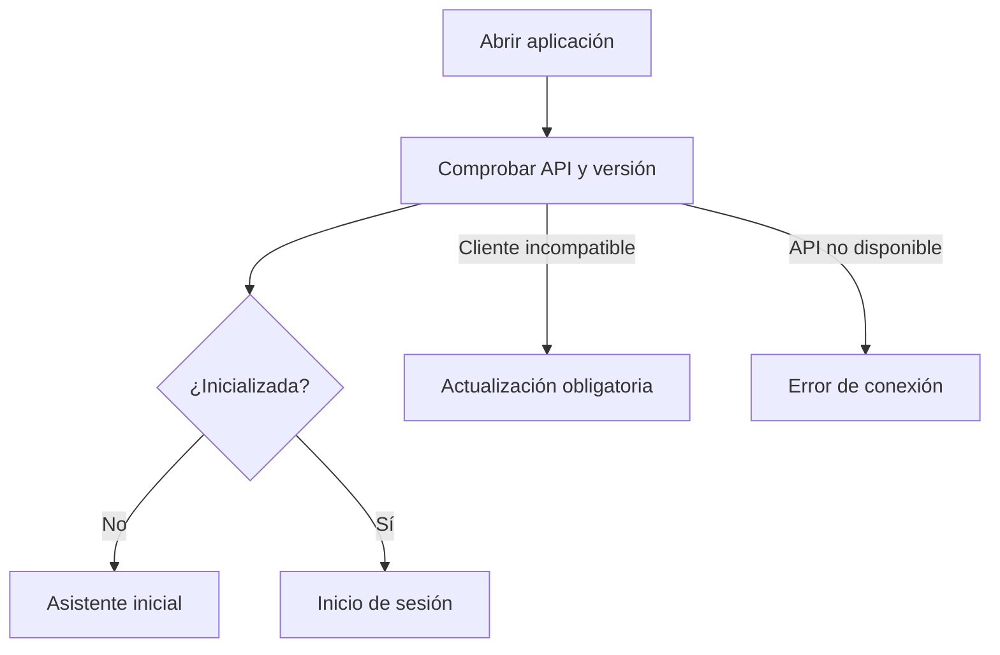
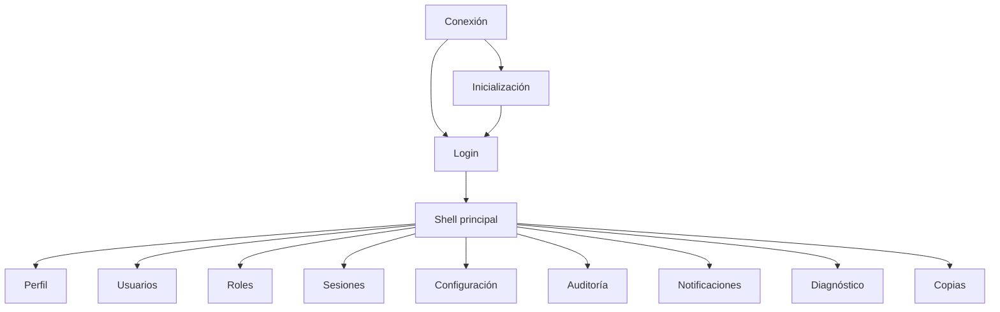

# Diseño de pantallas: Fase 0 - Plataforma

## 1. Propósito

Este documento define la experiencia de usuario de Plataforma para `CriGes.Desktop`.

Describe:

- Estructura general.
- Navegación.
- Pantallas.
- Formularios.
- Estados de carga y error.
- Confirmaciones.
- Permisos visibles.
- Procesos asíncronos.
- Accesibilidad.

No fija todavía colores, tipografías o componentes visuales definitivos.

## 2. Principios UX

### Claridad

- Una pantalla tiene una acción principal clara.
- Las acciones peligrosas se separan visualmente.
- Los estados se expresan con texto, no solo color.

### Continuidad

- Los filtros se conservan al volver a un listado.
- Los formularios avisan antes de descartar cambios.
- Tras guardar se mantiene el contexto del usuario.

### Seguridad

- No se muestran secretos completos.
- Los permisos no disponibles ocultan la acción.
- El servidor sigue siendo la autoridad.
- Las acciones sensibles exigen confirmación y motivo.

### Respuesta

- Las operaciones síncronas muestran progreso.
- Las operaciones largas devuelven al usuario el control.
- Los resultados asíncronos aparecen en la pantalla y en notificaciones.

### Consistencia

- Los mismos estados usan las mismas etiquetas.
- Los mismos patrones de filtros, tablas y formularios se reutilizan en todos los módulos.

## 3. Shell principal

```text
┌────────────────────────────────────────────────────────────────────┐
│ CriGes | Empresa | Entorno | Configuración pendiente | Usuario    │
├───────────────┬────────────────────────────────────────────────────┤
│ Navegación    │ Breadcrumbs                                        │
│               ├────────────────────────────────────────────────────┤
│ Inicio        │                                                    │
│ Clientes      │              Área de trabajo                       │
│ Catálogo      │                                                    │
│ ...           │                                                    │
│ Plataforma    │                                                    │
│               │                                                    │
├───────────────┴────────────────────────────────────────────────────┤
│ Estado API | Última sincronización | Versión | Correlation ID      │
└────────────────────────────────────────────────────────────────────┘
```

### Barra superior

Mostrará:

- Nombre de empresa.
- Entorno cuando no sea producción.
- Aviso de reinicio pendiente.
- Campana y contador de notificaciones.
- Usuario y rol.
- Menú de perfil.

### Navegación lateral

Solo muestra módulos permitidos.

Secciones de Plataforma para Administrador:

- Resumen.
- Usuarios.
- Roles y permisos.
- Sesiones.
- Configuración.
- Auditoría.
- Diagnóstico.
- Copias de seguridad.

### Barra inferior

- Estado de conexión.
- Versión Desktop.
- Versión API.
- Correlation ID del último error, cuando corresponda.

## 4. Patrones comunes

### Listados

Incluyen:

- Título.
- Acción primaria.
- Búsqueda.
- Filtros desplegables.
- Tabla.
- Ordenación.
- Paginación continua o botón `Cargar más`.
- Estado vacío.
- Acciones por fila.

### Formularios

- Etiquetas visibles.
- Campos obligatorios identificados.
- Validación al salir del campo y al guardar.
- Resumen de errores en la parte superior.
- Botones `Guardar` y `Cancelar`.
- ETag conservado internamente.

### Panel de detalle

Para información breve se utilizará un panel lateral derecho.

Para formularios extensos se navegará a una página.

### Diálogos

Se reservan para:

- Confirmaciones.
- Motivos.
- Contraseñas.
- Pruebas SMTP.
- Acciones irreversibles o de seguridad.

### Estados

Cada pantalla define:

- Cargando.
- Vacío.
- Error recuperable.
- Sin conexión.
- Sin permiso.
- Conflicto de concurrencia.

## 5. Arranque de la aplicación



## 6. Pantalla de conexión

### Objetivo

Comprobar API, compatibilidad y disponibilidad.

### Contenido

- Logotipo.
- Texto `Conectando con CriGes`.
- URL del servidor en modo diagnóstico.
- Indicador de progreso.

### Errores

- Servidor no disponible.
- Certificado no válido.
- Versión incompatible.
- Mantenimiento.

Acciones:

- Reintentar.
- Ver diagnóstico seguro.
- Cerrar.
- Actualizar aplicación, si procede.

## 7. Asistente de inicialización

### Navegación

Pasos:

1. Bienvenida.
2. Datos de empresa.
3. Dirección y contacto.
4. Administrador inicial.
5. Revisión.
6. Inicialización.

### Paso empresa

Campos:

- Razón social.
- Nombre comercial.
- NIF.

### Paso dirección

- Dirección.
- Código postal.
- Localidad.
- Provincia o región.
- País.
- Teléfono.
- Correo.

### Paso administrador

- Nombre completo.
- Nombre de usuario.
- Contraseña.
- Confirmar contraseña.
- Indicadores de cumplimiento de política.

### Revisión

No muestra la contraseña.

Incluye:

- Resumen.
- Advertencia de que el proceso solo puede ejecutarse una vez.
- Botón `Inicializar CriGes`.

### Progreso

- Bloquea la navegación.
- Muestra pasos técnicos sin secretos.
- Si falla, permite reintentar desde un estado limpio.

### Casos

PLT-CU-001.

## 8. Inicio de sesión

### Contenido

- Usuario.
- Contraseña.
- Botón `Iniciar sesión`.
- Estado de servidor.
- Versión.

No incluirá:

- Recordar contraseña.
- Recuperación automática por correo.
- Información que confirme si un usuario existe.

### Errores

- Mensaje genérico para credenciales incorrectas.
- Cuenta temporalmente bloqueada, mostrando el tiempo restante solo después de una respuesta explícita válida.
- Sesión ya activa.
- Usuario o rol desactivado.

### Sesión ya activa

El sistema no ofrece cerrar la otra sesión desde esta pantalla.

Mensaje:

`Ya existe una sesión activa. Contacta con un administrador si necesitas cerrarla.`

### Casos

PLT-CU-002 y 003.

## 9. Perfil de usuario

Se abre desde la barra superior.

Muestra:

- Nombre.
- Usuario.
- Rol.
- Inicio de sesión.
- Última actividad.

Acciones:

- Cambiar contraseña.
- Cerrar sesión.

### Cambiar contraseña

Diálogo con:

- Contraseña actual.
- Nueva contraseña.
- Confirmación.
- Requisitos visibles.

Tras guardar:

- Informa que la sesión se cerrará.
- Redirige a inicio de sesión.

### Casos

PLT-CU-004 y 006.

## 10. Aviso de caducidad de sesión

Ventana no bloqueante cinco minutos antes.

Contenido:

- Tiempo restante.
- Botón `Continuar trabajando`.
- Botón `Cerrar sesión`.

`Continuar trabajando` realiza una actividad válida contra API.

Si la sesión caduca:

- Se cierra el área de trabajo.
- No se guardan automáticamente formularios incompletos.
- Se muestra aviso antes de volver a login.

### Casos

PLT-CU-005.

## 11. Resumen de Plataforma

### Objetivo

Mostrar el estado operativo de la plataforma.

Tarjetas:

- Usuarios activos.
- Usuarios bloqueados.
- Sesiones activas.
- Configuración: correcta, advertencias o errores.
- Última copia verificada.
- Incidencias técnicas abiertas.
- Notificaciones críticas.

Paneles:

- Problemas de configuración.
- Actividad administrativa reciente.
- Estado de servicios.

Acciones rápidas:

- Crear usuario.
- Validar configuración.
- Crear copia.
- Abrir diagnóstico.

Los datos sensibles no aparecen.

## 12. Listado de usuarios

### Ruta lógica

`Plataforma > Usuarios`

### Encabezado

- Título.
- Botón `Nuevo usuario`.

### Filtros

- Texto.
- Rol.
- Estado.

### Columnas

- Nombre.
- Usuario.
- Rol.
- Estado.
- Último acceso.
- Bloqueado hasta.
- Acciones.

### Acciones por fila

Según estado:

- Editar.
- Restablecer contraseña.
- Desbloquear.
- Desactivar.
- Reactivar.
- Ver sesión.

No existe eliminar.

### Estados

- Vacío: `Todavía no hay usuarios adicionales`.
- Sin resultados.
- Error.

### Casos

PLT-CU-009 a 012.

## 13. Alta y edición de usuario

### Alta

Campos:

- Nombre completo.
- Nombre de usuario.
- Teléfono.
- Rol.
- Contraseña.
- Confirmación.

El nombre de usuario:

- Se normaliza visualmente.
- Informa que no podrá reutilizarse.

### Edición

Campos editables:

- Nombre.
- Teléfono.
- Rol.

El nombre de usuario no se modifica en la primera versión.

Si cambia el rol:

- Muestra advertencia de cierre de sesión.

### Concurrencia

Ante 409:

- Muestra `Este usuario fue modificado por otra persona`.
- Acciones `Recargar` y `Descartar mis cambios`.
- No combina automáticamente.

## 14. Acciones de seguridad sobre usuario

### Restablecer contraseña

Diálogo:

- Nueva contraseña.
- Confirmación.
- Requisitos.
- Advertencia de cierre de sesión.

### Desactivar

Diálogo obligatorio:

- Motivo.
- Resumen de impacto.
- Botón rojo `Desactivar usuario`.

### Reactivar

- Selección de rol activo si el anterior no lo está.
- Confirmación.

### Desbloquear

- Motivo obligatorio.
- Fecha de desbloqueo actual.

## 15. Roles y permisos

### Ruta lógica

`Plataforma > Roles y permisos`

### Diseño

Panel izquierdo:

- Lista de roles.
- Tipo.
- Estado.
- Número de usuarios.

Panel derecho:

- Nombre.
- Estado.
- Matriz de permisos.

### Matriz

Filas:

- Módulos.
- Acciones.

Columnas:

- Concedido.

Los permisos se agrupan y permiten:

- Marcar módulo completo.
- Marcar acciones individuales.
- Buscar permiso.

### Roles base

- Se muestran con candado.
- Controles deshabilitados.
- Texto `Rol protegido`.

### Rol personalizado

Acciones:

- Crear.
- Copiar.
- Guardar.
- Desactivar.
- Reactivar.

### Validaciones

- Nombre único.
- Al menos un permiso.
- Costes y márgenes no concedibles.

### Cambio con usuarios

Antes de guardar permisos:

- Muestra cuántos usuarios perderán su sesión.
- Solicita confirmación.

### Casos

PLT-CU-013 a 016.

## 16. Sesiones activas

### Ruta lógica

`Plataforma > Sesiones`

### Filtros

- Usuario.
- Estado.
- Fecha.

### Columnas

- Usuario.
- Rol.
- Inicio.
- Última actividad.
- Expira.
- Origen.
- Dispositivo.
- Estado.

### Acción

`Cerrar sesión`.

Diálogo:

- Motivo.
- Advertencia de impacto inmediato.

La propia sesión del administrador puede mostrarse diferenciada.

### Caso

PLT-CU-008.

## 17. Configuración general

### Navegación interna

Pestañas:

- Empresa.
- Ejercicios.
- Fiscalidad.
- Correo.
- Numeraciones.
- Validación.

Un indicador muestra si existen cambios pendientes de reinicio.

## 18. Configuración de empresa

### Secciones

#### Identidad

- Razón social.
- Nombre comercial.
- NIF.

El NIF aparece bloqueado cuando existan facturas emitidas.

#### Dirección

- Dirección.
- Código postal.
- Localidad.
- Provincia o región.
- País.

#### Contacto

- Prefijo.
- Teléfono.
- Correo.
- Web.

#### Registro

- Texto mercantil.

#### Cuenta bancaria

- Alias.
- IBAN.
- BIC.

#### Logotipo

- Vista previa.
- Cargar.
- Reemplazar.
- Retirar.
- Estado de análisis.

### Datos sensibles

- NIF e IBAN se muestran completos solo a usuarios autorizados.
- La pantalla de edición exige permiso de configuración.

### Guardado

Después de guardar:

- Muestra `Cambios guardados`.
- Activa el aviso `Reinicio requerido`.

### Caso

PLT-CU-017.

## 19. Ejercicios

### Listado

Columnas:

- Año.
- Fecha inicial.
- Fecha final.
- Estado.
- Creado por.
- Fecha.

### Nuevo ejercicio

Diálogo o página breve:

- Año.
- Desde.
- Hasta.

Propone año natural.

Al confirmar:

- Informa que se crearán contadores.
- Impide solapamientos.

No se modifica ni cierra desde esta pantalla en Fase 0.

### Caso

PLT-CU-018.

## 20. Fiscalidad

Pestañas:

- IVA.
- Retención.
- Causas fiscales.

### IVA

Tabla:

- Código.
- Nombre.
- Porcentaje.
- Vigencia.
- Estado.
- Usado.

Acciones:

- Nuevo tipo.
- Desactivar.

Un tipo usado:

- No ofrece edición retroactiva.
- La acción principal es `Crear nueva vigencia`.

### Retención

- Campo de porcentaje.
- Guardar.

### Causas fiscales

Tabla:

- Código.
- Descripción.
- Tipo.
- Estado.

Acciones:

- Nueva.
- Editar descripción.
- Activar o desactivar.

### Caso

PLT-CU-019.

## 21. Numeraciones

Pantalla exclusivamente de consulta.

### Filtros

- Ámbito.
- Ejercicio.
- Tipo.

### Columnas

- Contador.
- Ámbito.
- Ejercicio.
- Formato.
- Último número.
- Siguiente número.
- Última asignación.

No muestra botones de edición.

Texto informativo:

`Los contadores se gestionan automáticamente y no pueden modificarse manualmente.`

### Caso

PLT-CU-020.

## 22. Correo SMTP

### Formulario

- Servidor.
- Puerto.
- Seguridad.
- Usuario.
- Contraseña.
- Remitente.
- Nombre visible.
- Habilitado.

La contraseña guardada:

- Se muestra vacía.
- Texto `Dejar vacío para conservar la actual`.

### Prueba

Botón `Probar configuración`.

Abre diálogo:

- Destinatario.
- Resumen de parámetros.
- Botón `Enviar prueba`.

Resultado:

- Correcto.
- Error de conexión.
- Error de autenticación.
- Error TLS.
- Error de envío.

El diagnóstico incluye Correlation ID, no secretos.

### Deshabilitar

Acción separada que no borra datos.

### Caso

PLT-CU-021.

## 23. Validación de configuración

### Encabezado

- Estado global.
- Última ejecución.
- Botón `Validar ahora`.

### Resumen

- Errores.
- Advertencias.
- Correctos.

### Tabla

- Gravedad.
- Código.
- Descripción.
- Módulo.
- Acción `Resolver`.

`Resolver` navega a la pestaña adecuada.

### Historial

Lista de validaciones anteriores.

### Caso

PLT-CU-022.

## 24. Reinicio pendiente

### Aviso global

Banner en la barra superior:

`Hay cambios de configuración pendientes de reinicio.`

Acciones:

- Ver cambios.
- Entendido.

No se ofrece reinicio remoto del servidor desde Desktop.

La aplicación informa de que los cambios se aplicarán en el próximo reinicio operativo.

### Caso

PLT-CU-023.

## 25. Auditoría

### Ruta lógica

`Plataforma > Auditoría`

### Filtros

- Fecha desde y hasta.
- Usuario.
- Módulo.
- Acción.
- Entidad.
- Resultado.
- IP.
- Correlation ID.

### Columnas

- Fecha y hora.
- Actor.
- Módulo.
- Acción.
- Entidad.
- Resultado.
- Descripción.

### Detalle

Panel lateral:

- Actor.
- Origen.
- Sesión.
- Proceso.
- Motivo.
- Valores anteriores.
- Valores nuevos.
- Correlation ID copiable.

Los valores sensibles se ocultan.

### Acciones

- Aplicar filtros.
- Limpiar filtros.
- Exportar.

No existe editar ni eliminar.

### Exportación

Diálogo:

- Formato.
- Resumen de filtros.
- Confirmar.

Después:

- La exportación aparece como operación.
- Notificación al completarse.
- Botón de descarga hasta caducar.

### Casos

PLT-CU-024 y 025.

## 26. Centro de notificaciones

Se abre desde la campana o navegación.

### Pestañas

- No leídas.
- Todas.
- Archivadas.

### Filtros

- Gravedad.
- Fecha.

### Elemento

- Icono de gravedad.
- Título.
- Resumen.
- Fecha.
- Estado.
- Enlace.

### Acciones

- Marcar leída.
- Marcar no leída.
- Archivar.
- Selección múltiple.
- Abrir elemento.

Si el usuario ya no tiene permiso:

- Muestra `Ya no tienes acceso a este elemento`.
- Mantiene la notificación.

### Notificación crítica

Ventana emergente:

- Título.
- Mensaje mínimo.
- `Abrir`.
- `Cerrar`.

Cerrar la ventana no archiva ni marca necesariamente como leída.

### Casos

PLT-CU-026 y 027.

## 27. Componente de adjuntos

Componente reutilizable incrustado en otras pantallas.

### Listado

- Nombre.
- Descripción.
- Tamaño.
- Usuario.
- Fecha.
- Estado.
- Acciones.

### Carga

- Botón `Añadir archivo`.
- Selector.
- Descripción.
- Formatos y límite visibles.

Estados:

- Subiendo.
- Validando.
- Analizando.
- Disponible.
- Rechazado.

### Rechazo

Muestra una razón segura:

- Formato.
- Tamaño.
- Tipo incoherente.
- Malware.
- Análisis inconcluso.

### Acciones

- Descargar si está disponible.
- Reemplazar si tiene permiso.

No existe eliminar general.

### Reemplazo

- Confirmación.
- Informa de que no habrá versión anterior descargable.
- El nuevo archivo pasa por análisis completo.

### Casos

PLT-CU-028 a 030.

## 28. Diagnóstico técnico

### Ruta lógica

`Plataforma > Diagnóstico`

### Resumen

- Críticos abiertos.
- Errores recientes.
- Servicios degradados.

### Filtros

- Fecha.
- Gravedad.
- Módulo.
- Proceso.
- Estado.
- Correlation ID.

### Columnas

- Fecha.
- Gravedad.
- Módulo.
- Proceso.
- Descripción.
- Estado.
- Correlation ID.

### Detalle

- Descripción segura.
- Datos técnicos protegidos permitidos.
- Línea temporal.
- Actor o proceso.
- Acciones relacionadas.

### Acción `Marcar revisada`

- Notas.
- Confirmar.

### Exportación

Asíncrona y sin datos sensibles.

### Caso

PLT-CU-031.

## 29. Copias de seguridad

### Ruta lógica

`Plataforma > Copias de seguridad`

### Encabezado

- Última copia verificada.
- Estado del repositorio.
- Botón `Crear copia ahora`.

### Tabla

- Fecha solicitada.
- Usuario.
- Versión.
- Tamaño.
- Estado.
- Verificación.
- Acciones.

### Estados visibles

- Solicitada.
- Creando.
- Verificando.
- Verificada.
- Fallida.
- Incompatible.

### Crear copia

Diálogo:

- Motivo opcional o requerido por política.
- Resumen de contenido.
- Confirmar.

La pantalla:

- Añade la operación inmediatamente.
- Actualiza progreso.
- Permite seguir trabajando salvo mantenimiento.

### Verificar de nuevo

Disponible para copias creadas o verificadas.

### Caso

PLT-CU-032.

## 30. Restauración

La restauración es la acción más sensible de Plataforma.

### Inicio

Solo desde una copia verificada y compatible.

### Diálogo de impacto

Muestra:

- Fecha de la copia.
- Versión.
- Tamaño.
- Datos que se reemplazarán.
- Cierre de sesiones.
- Posible indisponibilidad.
- Copia previa automática cuando sea posible.

Campos:

- Motivo obligatorio.
- Texto de confirmación exacto: `RESTORE`.

Botón:

- `Iniciar restauración`.

### Progreso

Pantalla de mantenimiento:

- Validando.
- Creando copia previa.
- Restaurando base.
- Restaurando archivos.
- Verificando.
- Reiniciando.

No permite navegación normal.

### Resultado

- Completada: obliga a iniciar sesión.
- Fallida: muestra identificador de recuperación y contacto operativo.

### Caso

PLT-CU-033.

## 31. Operaciones asíncronas

### Centro de operaciones

Accesible desde un indicador de actividad.

Muestra:

- Tipo.
- Solicitante.
- Inicio.
- Progreso.
- Estado.
- Resultado.

Procesos:

- Exportaciones.
- Adjuntos.
- Copias.
- Restauraciones.

### Comportamiento

- La aplicación consulta estado si SignalR se desconecta.
- Una operación completada genera notificación.
- Una operación fallida muestra acción de diagnóstico.

## 32. Conflictos de concurrencia

Cuando la API devuelve 409:

Diálogo:

`Este registro ha cambiado desde que lo abriste.`

Acciones:

- `Recargar`.
- `Cancelar`.

No se permite sobrescribir a ciegas.

Para formularios extensos, puede mostrarse una comparación de campos en una fase posterior.

## 33. Errores y conexión

### Error de validación

- Junto al campo.
- Resumen superior.
- Foco al primer error.

### Error de negocio

- Mensaje claro.
- Código opcional en detalles.

### Error técnico

- Mensaje seguro.
- Correlation ID.
- Botón copiar.
- Acción reintentar cuando sea segura.

### Sin conexión

Banner persistente.

- Deshabilita comandos.
- Mantiene navegación por datos ya visibles.
- Reintenta conexión.
- No almacena comandos pendientes automáticamente.

## 34. Mantenimiento

Cuando la API entra en mantenimiento:

- Se bloquean nuevas operaciones.
- Desktop muestra una pantalla específica.
- Indica motivo y estado si están disponibles.
- Reintenta disponibilidad.

No se intenta eludir el mantenimiento con caché.

## 35. Accesibilidad

- Navegación completa por teclado.
- Orden de tabulación lógico.
- Etiquetas asociadas a campos.
- Foco visible.
- Contraste suficiente.
- Estados con texto e icono.
- Escalado de Windows.
- Lectores de pantalla mediante automatización WPF.
- No depender únicamente del color.

Atajos recomendados:

- `Ctrl+N`: nuevo en listados.
- `Ctrl+S`: guardar.
- `Esc`: cancelar o cerrar panel.
- `Ctrl+F`: buscar.
- `F5`: recargar.

Los atajos solo estarán activos cuando la acción sea válida.

## 36. Privacidad visual

- Las contraseñas se enmascaran.
- No existe botón permanente para mostrar secretos guardados.
- Los IBAN podrán mostrarse completos solo con permiso.
- Los errores no contienen datos personales completos.
- Al copiar un Correlation ID no se copian otros datos.

## 37. Resoluciones y adaptación

Objetivo inicial:

- Windows 10/11.
- Resolución mínima 1366x768.
- Escalado de 100 % a 200 %.

Comportamiento:

- Navegación lateral colapsable.
- Tablas con columnas adaptables.
- Formularios con desplazamiento vertical.
- Diálogos no mayores que el área disponible.

## 38. Mapa de navegación



## 39. Matriz de pantallas y API

| Pantalla | API principal |
|---|---|
| Conexión | Estado de instalación y salud |
| Inicialización | Instalación |
| Login | Auth |
| Perfil | Auth me, cambio de contraseña, logout |
| Usuarios | Users |
| Roles | Roles y permissions |
| Sesiones | Sessions |
| Empresa | Company y attachments |
| Ejercicios | Fiscal years |
| Fiscalidad | Tax rates, fiscal configuration y reasons |
| Numeraciones | Number counters |
| Correo | SMTP |
| Validación | Configuration validation y version |
| Auditoría | Audit events y exports |
| Notificaciones | Notifications y SignalR |
| Adjuntos | Attachments |
| Diagnóstico | Technical incidents |
| Copias | Backups y restore operations |
| Operaciones | Operations |

## 40. Trazabilidad con casos de uso

| Caso | Pantalla o componente |
|---|---|
| PLT-CU-001 | Asistente de inicialización |
| PLT-CU-002 | Inicio de sesión |
| PLT-CU-003 | Inicio de sesión y aviso de bloqueo |
| PLT-CU-004 | Shell y cierre de sesión |
| PLT-CU-005 | Aviso de caducidad y pantalla de sesión finalizada |
| PLT-CU-006 | Perfil y cambio de contraseña |
| PLT-CU-007 | Acción de seguridad sobre usuario |
| PLT-CU-008 | Sesiones activas |
| PLT-CU-009 | Alta de usuario |
| PLT-CU-010 | Edición de usuario |
| PLT-CU-011 | Listado y acciones de usuario |
| PLT-CU-012 | Acción de desbloqueo de usuario |
| PLT-CU-013 | Consulta de roles y matriz de permisos |
| PLT-CU-014 | Alta y copia de rol |
| PLT-CU-015 | Edición de la matriz de permisos |
| PLT-CU-016 | Listado y acciones de rol |
| PLT-CU-017 | Configuración de empresa |
| PLT-CU-018 | Ejercicios |
| PLT-CU-019 | Fiscalidad |
| PLT-CU-020 | Numeraciones |
| PLT-CU-021 | Correo SMTP |
| PLT-CU-022 | Validación |
| PLT-CU-023 | Aviso de reinicio |
| PLT-CU-024 | Auditoría |
| PLT-CU-025 | Exportación de auditoría |
| PLT-CU-026 | Centro de notificaciones |
| PLT-CU-027 | Notificación crítica emergente |
| PLT-CU-028 | Carga segura de adjuntos |
| PLT-CU-029 | Descarga de adjuntos |
| PLT-CU-030 | Reemplazo de adjuntos |
| PLT-CU-031 | Diagnóstico |
| PLT-CU-032 | Copias |
| PLT-CU-033 | Restauración |

## 41. Criterios de aceptación del diseño

1. Los 33 casos de uso tienen representación visual o automática.
2. Los módulos sin permiso no aparecen.
3. Las acciones sin permiso no aparecen.
4. Ninguna pantalla muestra secretos guardados.
5. Toda acción sensible exige confirmación.
6. Las acciones que lo requieren solicitan motivo.
7. Los listados mantienen filtros al navegar.
8. Los formularios protegen cambios sin guardar.
9. Los conflictos no sobrescriben datos.
10. Los procesos largos no bloquean toda la aplicación salvo restauración.
11. Las notificaciones críticas son visibles.
12. Los adjuntos muestran su estado de análisis.
13. Los errores técnicos incluyen Correlation ID.
14. La navegación funciona con teclado.
15. La interfaz soporta 1366x768 y escalado.

## 42. Pendientes para diseño visual

- Sistema de diseño y paleta.
- Tipografía.
- Biblioteca de controles WPF.
- Iconografía.
- Wireframes de alta fidelidad.
- Prototipo navegable.
- Pruebas de usabilidad.
- Textos finales y microcopy.
- Comportamiento exacto del shell en pantallas pequeñas.

La verificación funcional y técnica de estas pantallas se define en [Plan de pruebas de Plataforma](08-plan-de-pruebas.md).
